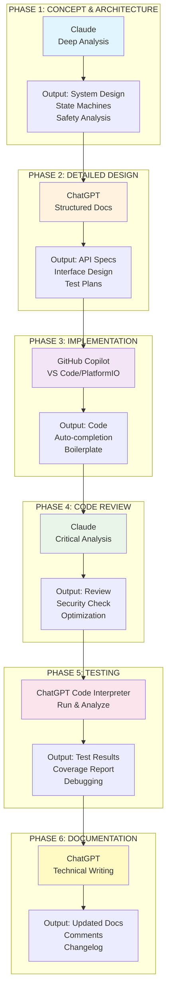

# 🧠 AI COLLABORATION PLAYBOOK v1.1 - SMART MOSQUE PROJECT

```
╔═══════════════════════════════════════════════════════════════╗
║                                                               ║
║   AI COLLABORATION PLAYBOOK v1.1                             ║
║   Panduan Standar untuk Kolaborasi dengan AI Assistant       ║
║                                                               ║
║   Status: Updated - Sinkron dengan Dokumen Utama             ║
║   Berdasarkan: Kebenaran Tunggal v1.4, STP v1.3, HIG v1.1   ║
║   Terakhir Diupdate: 30 Desember 2025                        ║
║                                                               ║
╚═══════════════════════════════════════════════════════════════╝
```

---

## 🎯 BAGIAN 1: TUJUAN & FALSAFAH

### **1.1 Mengapa Playbook Ini Dibutuhkan?**

Sebagai one-person team yang mengembangkan sistem kompleks, Anda akan bergantung pada berbagai AI Assistant (ChatGPT, Claude, Copilot, dll). Playbook ini menjamin:

1. **Konsistensi**: Semua AI bekerja dengan konteks yang sama
2. **Efisiensi**: Tidak perlu jelaskan ulang dari nol setiap sesi
3. **Kualitas**: Output AI sesuai dengan filosofi sistem Anda
4. **Learning**: Membangun knowledge base yang terstruktur

### **1.2 Prinsip Dasar Kolaborasi**

```
ANDA = Ahli Lapangan & System Owner
AI   = Technical Assistant & Code Generator

HUBUNGAN: Partnership, bukan master-servant
TUJUAN: Bangun sistem yang reliable, maintainable, dan scalable
```

### **1.3 Dokumen Referensi Wajib**

```
┌─────────────────────────────────────────────────────────────┐
│ DOKUMEN UTAMA (SINGLE SOURCE OF TRUTH)                      │
├─────────────────────────────────────────────────────────────┤
│ 1. 📘 KEBENARAN_TUNGGAL_v1.4.md                            │
│    • Filosofi & Prinsip Inti (5 prinsip non-negotiable)    │
│    • Arsitektur Dual Master                                 │
│    • Manual Priority Philosophy (NEW in v1.4)              │
│    • Fail-Safe Matrix                                       │
│    • Device Addressing & Naming                             │
│                                                              │
│ 2. ⚙️ SPESIFIKASI_TEKNIS_PROTOKOL_v1.3.md                  │
│    • Physical & Data Link Layer (RS-485)                    │
│    • Frame Format Detail (byte-by-byte)                     │
│    • 8 Command Opcodes (0x01-0x08)                         │
│    • CRC16-MODBUS Implementation                            │
│    • State Machines (Master & Slave)                        │
│    • Enhanced Error Handling (NEW in v1.3)                  │
│                                                              │
│ 3. 🔌 PANDUAN_INTEGRASI_HARDWARE_v1.1.md                   │
│    • Complete BOM (Bill of Materials)                       │
│    • Wiring Diagrams (Master, Slave, DPDT)                 │
│    • DPDT 6-pin Changeover Detail (NEW in v1.1)            │
│    • Step-by-Step Installation (4 phases)                   │
│    • Commissioning & Testing (7 test scenarios)            │
│    • Troubleshooting Guide                                  │
│                                                              │
│ 4. 🧠 AI_COLLABORATION_PLAYBOOK_v1.1.md (dokumen ini)      │
│    • Template Prompts                                       │
│    • Workflow Multi-AI                                      │
│    • Debugging Protocol                                     │
│    • Knowledge Management                                   │
└─────────────────────────────────────────────────────────────┘
```

---

## 📋 BAGIAN 2: SETUP AWAL SETIAP SESI AI

### **2.1 Template Prompt WAJIB untuk Setiap AI Baru**

**SALIN DAN GUNAKAN TEMPLATE INI** di chat pertama dengan AI baru:

```markdown
[[KONTEKS PROYEK SMART MOSQUE - HARAP BACA SEBELUM MEMBANTU]]

Saya mengembangkan sistem otomasi masjid berbasis ESP32 dan RS-485. 
Mohon baca konteks ini sebelum memberikan bantuan apapun.

**PRINSIP DASAR SISTEM (TIDAK BISA DIUBAH):**
1. AUTO-ENROLLMENT: Perangkat baru otomatis terdaftar tanpa konfigurasi manual
2. FAIL-SAFE OTOMATIS: Jika komunikasi terputus >300 detik, sistem ambil 
   keputusan safety otomatis (Lampu: ON, Kipas: OFF, Sound: OFF)
3. DUAL MASTER: Logic Master (ID:254) sebagai otak + Display Master (ID:255) 
   sebagai UI, concerns terpisah untuk reliability
4. ONE FIRMWARE: Satu firmware untuk semua Slave (FAN/LIGHT/SOUND), fungsi 
   ditentukan oleh profile di NVS
5. MANUAL PRIORITY: Manual control SELALU berfungsi, automation adalah layer 
   tambahan. Parallel wiring (Lampu/Sound), DPDT changeover (Kipas)

**ARSITEKTUR UTAMA:**
- Master Logic (ID:254): ESP32-S3 DevKit + ILI9488 4" Status Display
  • Handle RS-485 bus communication
  • Auto-enrollment & device registry (NVS database)
  • Heartbeat sender (60s interval)
  • Fail-safe executor
  
- Display Master (ID:255): Waveshare ESP32-S3-Touch-LCD-7"
  • LVGL touchscreen UI (800x480)
  • User control panel
  • Web dashboard (WiFi)
  • Real-time visualization
  
- Slave Nodes (ID:1-247): ESP32 DevKit V1 + MAX3485 + 8CH SSR
  • Profile types: FAN_4CH (13 nodes), LIGHT_8CH (4 nodes), SOUND_8CH (1 node)
  • Total: 18 slave nodes, 92 relay control points
  • Mode detection (AUTO/MANUAL) untuk kipas via DPDT switch
  • Execute relay commands with safety interlock (FAN only)

**PROTOKOL KOMUNIKASI:**
- Physical: RS-485 bus, UTP Cat5/6 daisy-chain, 115200bps, 8N1
- Frame: START(0x7E) + ADDR + CMD + LEN + PAYLOAD + CRC16 + END(0x0A)
- Commands: 0x01(DISCOVERY_ANNOUNCE), 0x02(DISCOVERY_RESPONSE), 
  0x03(SET_RELAY), 0x04(HEARTBEAT), 0x05(STATUS_REPORT), 
  0x06(FORCE_RESET), 0x07(ACK), 0x08(NACK)
- CRC: CRC16-MODBUS, polynomial 0x8005, init 0xFFFF
- Timing: Heartbeat 60±5s, Fail-safe timeout 300s (FIXED)

**MANUAL CONTROL STRATEGY:**
- Lampu & Sound: Parallel OR logic (manual switch || SSR output → load)
  No conflict, no mode switch needed
- Kipas: DPDT 6-pin changeover switch
  • Position AUTO: SSR path powered (Pin 2→1, 5→4)
  • Position MANUAL: Speed switch powered (Pin 2→3, 5→6)
  • Mode detection via GPIO35 (HIGH=AUTO, LOW=MANUAL)
  • Physical isolation prevents conflicts

**FAIL-SAFE BEHAVIOR (Heartbeat hilang >300s):**
- LIGHT_8CH: FORCE ALL ON (safety: visibility untuk jamaah)
- FAN_4CH: FORCE ALL OFF (safety: cegah overheating tanpa monitoring)
- SOUND_8CH: FORCE ALL OFF (safety: cegah noise tak terkontrol)
- LED: RED steady (visual indicator fail-safe mode)
- Recovery: Auto saat heartbeat restored

**HARDWARE SPECS (KEY COMPONENTS):**
- Master Logic: ESP32-S3 (16MB Flash, 8MB PSRAM), ILI9488 4" SPI
- Display Master: Waveshare ESP32-S3-Touch-LCD-7 (built-in RS-485)
- Slave: ESP32 DevKit V1, MAX3485, G3MB-202P SSR (5V ctrl, 2A load)
- PSU: HLK-PM03 (220VAC→5VDC/3A) per node
- Mode Switch (kipas only): DPDT 6-pin, 10A/250VAC changeover
- Protection: MOV 275VAC, RC snubber per SSR (inductive loads)

**PINOUT STANDARD (WAJIB - Semua Slave):**
- RS-485: RX=GPIO16, TX=GPIO17, DE/RE=GPIO4
- Relay 1-8: GPIO 12,13,14,15,25,26,27,32
- Mode Detect (kipas): GPIO35 (HIGH=AUTO, LOW=MANUAL)
- LED Status: GPIO2 (onboard)

**ADDRESSING SCHEME:**
- 0x00: Broadcast (untuk HEARTBEAT)
- 0x01-0x0D (1-13): Kipas nodes (FAN_4CH)
- 0x0E-0x11 (14-17): Lampu nodes (LIGHT_8CH)
- 0x12 (18): Sound node (SOUND_8CH)
- 0x13-0xF7 (19-247): Reserved (future expansion)
- 0xFE (254): Logic Master (fixed)
- 0xFF (255): Display Master (fixed)

**DOKUMEN REFERENSI LENGKAP:**
1. Kebenaran Tunggal v1.4 - Filosofi, arsitektur, manual priority
2. Spesifikasi Teknis Protokol v1.3 - Byte-level protocol, state machines
3. Panduan Integrasi Hardware v1.1 - BOM, wiring, DPDT detail, commissioning

**PERAN ANDA (AI ASSISTANT):**
Anda adalah partner teknis saya. Tugas Anda:
1. Pahami konteks sistem secara holistic
2. Pastikan semua saran/kode sesuai dengan dokumen referensi
3. Jelaskan konsep teknis dengan analogi kelistrikan/instalasi jika perlu
4. Tanyakan klarifikasi jika ada ambiguitas
5. Jangan asumsi atau ubah arsitektur dasar tanpa konfirmasi eksplisit
6. Prioritaskan reliability & maintainability over complexity
7. Ingat: Manual control adalah prioritas, automation adalah kemudahan tambahan

**CRITICAL NOTES:**
- NVS write: ALWAYS use compare-before-write untuk hemat flash wear
- Kipas: Enforce interlock (only one of LOW/MED/HIGH ON) + 200ms dead-time
- Fail-safe timeout: EXACTLY 300 seconds, tidak bisa dikonfigurasi
- RS-485 termination: 120Ω resistor ONLY at first & last node
- Mode switch rejection: Kipas di MANUAL harus reject RS-485 commands

**TUGAS SAAT INI:**
[SILAKAN ISI DENGAN TUGAS SPESIFIK ANDA]
```

### **2.2 Format Referensi Dokumen**

Gunakan format ini saat merujuk ke dokumen lain:

```
CONVENTION:
[KT-X.Y]  = Kebenaran Tunggal v1.4, Bagian X, Sub-bagian Y
[STP-X.Y] = Spesifikasi Teknis Protokol v1.3, Bagian X, Sub-bagian Y
[HIG-X.Y] = Panduan Integrasi Hardware v1.1, Bagian X, Sub-bagian Y

CONTOH REFERENSI SPESIFIK:
┌─────────────────────────────────────────────────────────────┐
│ [KT-1.2]   - Prinsip Inti (5 prinsip non-negotiable)       │
│ [KT-2.1]   - Diagram Arsitektur Lengkap                     │
│ [KT-3.1]   - Fail-Safe Actions Matrix                       │
│ [KT-3.2]   - Manual Control Strategy (NEW)                  │
│ [KT-6.1]   - Device ID Allocation                           │
│                                                              │
│ [STP-2.1]  - Physical Layer Specification                   │
│ [STP-3.1]  - Frame Structure Byte-by-Byte                   │
│ [STP-4.2.3]- Command SET_RELAY Detail                       │
│ [STP-4.2.4]- Heartbeat Mechanism                            │
│ [STP-4.2.5]- STATUS_REPORT Payload                          │
│ [STP-5.1]  - Slave State Machine                            │
│ [STP-6.2]  - CRC16-MODBUS Implementation                    │
│                                                              │
│ [HIG-2.1]  - Master Logic BOM                               │
│ [HIG-2.3]  - Slave Node BOM (per device)                    │
│ [HIG-3.2]  - Slave Node Wiring (Generic)                    │
│ [HIG-3.3]  - Kipas Node with DPDT Wiring (NEW)             │
│ [HIG-5.1]  - Power Budget Calculation                       │
│ [HIG-6.2]  - Master Logic Commissioning                     │
│ [HIG-6.3]  - Slave Enrollment Procedure                     │
│ [HIG-7.2]  - Troubleshooting Table                          │
└─────────────────────────────────────────────────────────────┘

CONTOH PENGGUNAAN DALAM PROMPT:
"Berdasarkan [KT-3.2] tentang Manual Priority Philosophy dan 
[HIG-3.3] tentang DPDT wiring, saya perlu implementasi fungsi 
mode detection di slave kipas. Mode switch di GPIO35, HIGH=AUTO, 
LOW=MANUAL. Dalam mode MANUAL, slave harus reject semua SET_RELAY 
commands dan send NACK dengan error code 0x04."
```

### **2.3 Verifikasi AI Memahami Konteks**

Setelah kirim template, **WAJIB** tanya untuk verifikasi:

```
"Sebutkan 5 prinsip dasar sistem Smart Mosque dan jelaskan perbedaan 
fungsi Logic Master vs Display Master. Juga jelaskan filosofi Manual Priority 
untuk kipas (DPDT changeover) vs lampu/sound (parallel wiring)."
```

**Expected Answer AI harus mencakup:**

1. ✅ Lima prinsip: Auto-Enrollment, Fail-Safe, Dual Master, One Firmware, Manual Priority
2. ✅ Logic Master: Handle RS-485 bus, enrollment, heartbeat, fail-safe executor
3. ✅ Display Master: LVGL UI, web dashboard, user control, visualization
4. ✅ Manual Priority: Manual control independent, automation sebagai layer tambahan
5. ✅ DPDT (kipas): Physical changeover switch, isolasi AUTO/MANUAL path
6. ✅ Parallel (lampu/sound): OR logic, no conflict, no mode switch needed

**Jika AI salah/jawab umum:** Kirim ulang template dengan emphasis atau cari AI lain.

---

## 🛠️ BAGIAN 3: TEMPLATE PROMPT UNTUK BERBAGAI TUGAS

### **3.1 Kategori Tugas & Template**

#### **TEMPLATE A: KONSEP & ARSITEKTUR**

```markdown
[Template Konteks dari Bagian 2.1 di atas]

**TUGAS: Rancangan/analisis konsep**
**REFERENSI:** [KT-X.Y] dan/atau [STP-X.Y] yang relevan
**PROBLEM/IDEA:** 
[Jelaskan ide atau masalah dengan detail]

**CONSTRAINT:** 
- Hardware: [batasan hardware]
- Software: [batasan software]
- Prinsip sistem: [prinsip mana yang harus dipertahankan]

**EXPECTED OUTPUT:** 
[Format output, e.g., diagram mermaid, tabel, penjelasan terstruktur]

**CONTOH KASUS NYATA v1.4:**
"Berdasarkan [KT-3.2] tentang Manual Priority Philosophy dan 
[HIG-3.3] tentang DPDT 6-pin wiring, saya perlu rancangan 
electrical interlock untuk kipas:

PROBLEM: Bagaimana memastikan SSR path dan speed switch path 
tidak bisa aktif bersamaan (hardware safety)?

CONSTRAINT:
- Hardware: DPDT 6-pin changeover switch (10A/250VAC)
- SSR commons harus terpisah dari speed switch input
- Mode detection via GPIO35 (firmware level)
- Manual switch harus tetap berfungsi saat ESP32 mati

EXPECTED OUTPUT:
1. Wiring diagram detail untuk DPDT connections
2. Truth table untuk switch positions
3. Failure mode analysis (what if switch di tengah?)
4. Testing procedure untuk verify interlock

Referensi tambahan: [HIG-5.3] untuk protection scheme."
```

#### **TEMPLATE B: IMPLEMENTASI KODE**

```markdown
[Template Konteks dari Bagian 2.1 di atas]

**TUGAS: Implementasi kode/firmware**
**REFERENSI:** 
- Protokol: [STP-X.Y]
- Hardware: [HIG-X.Y]
- Prinsip: [KT-X.Y]

**MODULE:** [Nama modul/fungsi spesifik]

**FUNCTION SPEC:**
- Signature: `returnType functionName(params)`
- Input: [Deskripsi parameter dengan tipe data]
- Output: [Return value dan side effects]
- Behavior: [Apa yang harus dilakukan step-by-step]
- Error Handling: [Kondisi error dan response]

**CONTEXT CODE (jika ada):** 
```cpp
// Tempel kode existing yang related (max 50 baris)
```

**TEST CASE:** 
1. Normal case: [Input → Expected output]
2. Edge case: [Input → Expected output]
3. Error case: [Input → Expected error handling]

**CONTOH KASUS NYATA v1.3:**
"Berdasarkan [STP-5.1] tentang Slave State Machine dan 
[STP-4.2.3] tentang SET_RELAY command, implementasikan 
fungsi `handleSetRelay()` di slave firmware.

MODULE: Slave Command Handler

FUNCTION SPEC:
- Signature: `bool handleSetRelay(RS485Frame* frame)`
- Input: Pointer ke parsed frame dengan payload SET_RELAY
- Output: true jika executed, false jika rejected
- Behavior:
  1. Check current state (AUTO/MANUAL/FAILSAFE)
  2. If MANUAL: Send NACK(0x04), return false
  3. If FAILSAFE: Ignore command silently, return false
  4. If AUTO: Proceed to step 5
  5. Parse relay_mask and values from payload (binary format)
  6. For FAN profile: Validate interlock (only one speed ON)
  7. If interlock violated: Send NACK(0x05), return false
  8. Execute relay changes with safety dead-time (200ms for FAN)
  9. Send STATUS_REPORT to confirm
  10. Send ACK to Master
  11. Return true
- Error Handling:
  - Invalid payload length: NACK(0x02)
  - Profile mismatch: NACK(0x07)
  - NVS corruption detected: Enter fail-safe, log error

CONTEXT CODE:
```cpp
// Current state variable
SlaveState currentState = STATE_AUTO;
uint8_t myProfile = PROFILE_FAN_4CH;
uint8_t relayStates[8] = {0}; // Current relay states

// Helper function available
void setRelay(uint8_t index, bool state);
bool isInterlockViolation(uint8_t* values);
void sendNACK(uint8_t errorCode);
void sendStatusReport();
```

TEST CASE:
1. Normal: Frame with mask=0x02, values=[0,1,0,0,0,0,0,0] (MED speed)
   → Execute MED relay, send STATUS_REPORT + ACK, return true
2. Edge: Multiple SET_RELAY commands rapid succession
   → Queue or reject dengan NACK(0x0A) buffer overflow
3. Error: Frame dengan mask=0x07 (multiple speeds) pada FAN profile
   → Send NACK(0x05) interlock violation, tidak execute, return false
4. Error: Command diterima saat state=MANUAL
   → Send NACK(0x04), return false immediately

Referensi tambahan: [KT-3.1] untuk fail-safe behavior."
```

#### **TEMPLATE C: DEBUGGING & TROUBLESHOOTING**

```markdown
[Template Konteks dari Bagian 2.1 di atas]

**MASALAH:** [Gejala spesifik dan jelas]

**KODE YANG RELEVAN:** 
```cpp
// Tempel kode singkat (max 50 baris, fokus ke area problematic)
```

**ENVIRONMENT:**
- Board: [ESP32-S3 DevKit / ESP32 DevKit V1 / Waveshare]
- Arduino Core: [Version, e.g., 2.0.14]
- Library: [Library names + versions]
- IDE: [PlatformIO / Arduino IDE]
- Other devices on bus: [Jumlah dan tipe, e.g., "1 Master + 3 Slaves"]
- Power supply: [5V/3A sufficient? Voltage measured?]

**SUDAH DICOBA:** 
1. [Langkah troubleshooting 1]
2. [Langkah troubleshooting 2]
3. [Langkah troubleshooting 3]

**ERROR MESSAGE / LOG:** 
```
[Tempel serial monitor output atau error message lengkap]
```

**REFERENSI:** [Bagian dokumen yang mungkin related]

**EXPECTED VS ACTUAL:** 
- Expected: [Seharusnya terjadi apa berdasarkan spec]
- Actual: [Yang benar-benar terjadi]

**CONTOH KASUS NYATA v1.3:**
"MASALAH: Slave kipas tidak respon SET_RELAY command, tapi STATUS_REPORT 
tetap kirim setiap 60 detik. Dashboard show device ONLINE tapi control 
buttons tidak berfungsi.

KODE RELEVAN:
```cpp
void handleSetRelay(RS485Frame* frame) {
  // Check mode
  bool isAuto = digitalRead(MODE_DETECT_PIN); // GPIO35
  
  if (!isAuto) {
    sendNACK(0x04); // Manual mode
    return;
  }
  
  // Parse payload
  uint8_t mask = frame->payload[0];
  uint8_t* values = &frame->payload[1];
  
  // Validate interlock (FAN profile)
  if (myProfile == PROFILE_FAN_4CH) {
    int speedCount = values[0] + values[1] + values[2];
    if (speedCount > 1) {
      sendNACK(0x05); // Interlock violation
      return;
    }
  }
  
  // Execute relay
  for (int i = 0; i < 8; i++) {
    if (mask & (1 << i)) {
      setRelay(i, values[i]);
    }
  }
  
  sendStatusReport();
  sendACK();
}
```

ENVIRONMENT:
- Board: ESP32 DevKit V1
- Arduino Core: 2.0.14
- Library: None (native Serial2)
- IDE: PlatformIO
- Other devices: 1 Master Logic + 1 Display Master + 1 Slave (this one)
- Power: HLK-PM03, measured 4.98V at ESP32 VIN

SUDAH DICOBA:
1. Cek wiring RS-485: Continuity OK, A-A connected, B-B connected
2. Ganti MAX3485: Masalah sama
3. Test dengan terminator 120Ω: Ada dan benar
4. Monitor serial: Tidak ada error message
5. LED status: Hijau steady (AUTO mode)
6. Mode switch: Posisi AUTO (GPIO35 reads HIGH)
7. Test dengan SET_RELAY direct via serial: Relay bergerak OK
8. Swap dengan slave lain: Slave lain berfungsi normal di posisi yang sama

ERROR LOG:
```
[15:23:45] ✓ HEARTBEAT received
[15:23:45] → Sending STATUS_REPORT
[15:24:12] ✓ HEARTBEAT received
[15:24:12] → Sending STATUS_REPORT
[15:24:45] ✓ HEARTBEAT received
[15:24:45] → Sending STATUS_REPORT
// No log entry for SET_RELAY received
```

REFERENSI: 
- [STP-4.2.3] untuk SET_RELAY specification
- [HIG-7.2] troubleshooting table

EXPECTED: 
Saat user touch "MED" button di dashboard, slave harus:
1. Receive SET_RELAY frame (log: "→ SET_RELAY received")
2. Parse payload dan validate
3. Execute relay 2 (MED)
4. Send STATUS_REPORT
5. Send ACK

ACTUAL:
- Dashboard send command (verified dengan Master serial log)
- Slave tidak ada log "SET_RELAY received"
- Relay tidak bergerak
- STATUS_REPORT tetap kirim setiap 60s (via heartbeat trigger)
- No error message at all

HYPOTHESIS:
Frame SET_RELAY mungkin corrupt atau tidak sampai ke slave, 
tapi HEARTBEAT sampai normal. Atau address filtering salah?"
```

#### **TEMPLATE D: DOKUMENTASI & REVIEW**

```markdown
[Template Konteks dari Bagian 2.1 di atas]

**TUGAS: Review/update dokumentasi**
**DOKUMEN:** [KT/STP/HIG/Playbook] v[X.Y]
**SECTION:** [Bagian yang direview/diupdate]
**CHANGES:** [Perubahan yang dibuat/mau dibuat]
**REASON:** [Alasan perubahan]
**IMPACT:** [Apa yang terpengaruh - firmware, hardware, workflow]
**VERSION:** [Versi baru target, e.g., v1.5]

**BACKWARD COMPATIBILITY:**
[Apakah breaking change? Apakah perlu migration guide?]

**TESTING REQUIRED:**
[Test apa yang perlu dilakukan untuk verify changes]

**CONTOH KASUS NYATA v1.4:**
"TUGAS: Update STP dengan enhancement fail-safe behavior.

DOKUMEN: Spesifikasi Teknis Protokol v1.3
SECTION: 
- [STP-4.2.5] STATUS_REPORT payload
- [STP-5.1] Slave State Machine

CHANGES:
1. Tambah field 'fail_safe_reason' di STATUS_REPORT payload:
   ```json
   {
     ...existing fields...
     'fail_safe_reason': 'TIMEOUT' | 'MANUAL_TRIGGER' | 'SENSOR_FAULT'
   }
   ```
2. Update state machine diagram untuk include FAILSAFE entry reasons
3. Tambah opcode baru 0x09 untuk manual fail-safe trigger dari Master

REASON:
Saat troubleshooting, perlu tau WHY device masuk fail-safe:
- Network timeout (heartbeat loss) → 300s automatic
- Manual trigger dari dashboard → emergency stop
- Sensor fault detected → safety precaution

IMPACT:
- Slave firmware: Update STATUS_REPORT function (minor change)
- Master firmware: Parse new field, update dashboard UI
- Display Master: Show fail-safe reason di device status panel
- Protocol: Tidak breaking, backward compatible (new field optional)

VERSION: STP v1.4 (minor version bump)

BACKWARD COMPATIBILITY:
✓ Compatible: Old Master dapat parse new STATUS_REPORT (ignore unknown fields)
✓ Compatible: Old Slave dapat receive new HEARTBEAT (payload unchanged)
✗ Feature loss: Old Slave tidak send 'fail_safe_reason', Master show 'UNKNOWN'

TESTING REQUIRED:
1. Mixed version test: Master v1.4 + Slave v1.3 → Should work
2. Fail-safe timeout test: Verify reason='TIMEOUT'
3. Manual trigger test: Verify reason='MANUAL_TRIGGER'
4. UI test: Dashboard show correct reason text

MIGRATION GUIDE:
- Update Master firmware first (parse new field, default 'TIMEOUT' if missing)
- Update Slaves gradually (no rush, backward compatible)
- Update documentation: Add fail-safe reason codes table

Referensi cross-check: [KT-3.1] fail-safe matrix untuk consistency."
```

### **3.2 Template Cepat (Quick Templates)**

#### **Untuk Penjelasan Konsep:**

```
"Jelaskan konsep [X] dalam sistem Smart Mosque dengan analogi 
teknisi listrik yang familiar dengan instalasi rumah/gedung.

Contoh kasus: [kasus nyata dari implementasi].
Referensi: [dokumen-bagian].

Berikan:
1. Analogi sederhana (5-7 kalimat)
2. Mapping ke sistem kita (komponen spesifik)
3. Common pitfalls dan cara hindari
4. Testing procedure untuk verify"
```

**Contoh Konkret:**
```
"Jelaskan konsep 'compare-before-write' untuk NVS management dalam 
sistem Smart Mosque dengan analogi teknisi listrik.

Contoh kasus: Device registry di Master Logic punya 247 slot, setiap 
STATUS_REPORT bisa trigger NVS write. Without optimization, NVS wear 
out cepat (100k cycles limit).

Referensi: [KT-4.3] Database Persistence Strategy.

Berikan:
1. Analogi: Seperti apa compare-before-write dalam konteks pekerjaan listrik?
2. Mapping: Di Master Logic, field mana yang sering berubah vs jarang berubah?
3. Pitfalls: Apa yang terjadi jika lupa compare? Berapa lama flash akan rusak?
4. Testing: Cara monitor NVS write count dan verify optimization bekerja?"
```

#### **Untuk Contoh Kode:**

```
"Beri contoh implementasi [fungsi] berdasarkan [dokumen-bagian].

Constraint: 
- [batasan hardware, e.g., RAM < 200KB]
- [batasan timing, e.g., response < 100ms]
- [batasan safety, e.g., interlock mandatory]

Contoh penggunaan: [skenario spesifik]

Include:
1. Function signature dengan doxygen comments
2. Error handling untuk semua edge cases
3. Test code untuk verify behavior
4. Performance consideration (RAM, CPU, timing)"
```

**Contoh Konkret:**
```
"Beri contoh implementasi fungsi `modeDetectionTask()` untuk kipas slave 
berdasarkan [HIG-3.3] DPDT wiring dan [STP-5.1] state machine.

Constraint:
- GPIO35 untuk mode detection (HIGH=AUTO, LOW=MANUAL)
- Debouncing diperlukan (switch mechanical bounce)
- Response time < 50ms setelah switch flip
- Must handle transient state saat switch di tengah-tengah
- Memory: Minimize allocation, prefer stack

Contoh penggunaan: User flip DPDT dari AUTO ke MANUAL saat kipas 
running di MED speed. Fungsi harus:
1. Detect mode change dalam 50ms
2. Turn off all SSR immediately (clean state)
3. Update LED indicator (GREEN → YELLOW)
4. Send STATUS_REPORT dengan mode='MANUAL'
5. Start rejecting SET_RELAY commands

Include:
1. Function dengan doxygen comments
2. Debouncing logic (prevent false triggers)
3. State transition handling
4. Edge case: Switch flip rapid succession
5. Performance: Execution time estimation"
```

#### **Untuk Code Review:**

```
"Review kode berikut vs [dokumen-bagian]. 

Check specifically:
1. Protocol compliance: [specific protocol aspect]
2. Error handling: [specific error scenarios]
3. Memory efficiency: [RAM/Flash usage]
4. Safety considerations: [specific safety concerns]
5. Timing compliance: [specific timing requirements]

Kode:
```cpp
[tempel kode max 100 baris]
```

Beri feedback dalam format:
✓ GOOD: [aspect yang sudah benar]
⚠ WARNING: [aspect yang perlu perhatian]
✗ CRITICAL: [aspect yang HARUS diperbaiki]
💡 SUGGESTION: [improvement optional]
```

**Contoh Konkret:**
```
"Review kode DPDT mode detection berikut vs [HIG-3.3] wiring spec 
dan [KT-3.2] manual priority philosophy.

Check specifically:
1. Protocol compliance: STATUS_REPORT harus include mode_switch field
2. Error handling: GPIO read error, transient state saat switch flip
3. Memory efficiency: Debounce buffer size reasonable?
4. Safety considerations: SSR MUST turn off before entering MANUAL
5. Timing: Mode change detection < 50ms

Kode:
```cpp
// Mode detection task (FreeRTOS)
void modeDetectionTask(void* params) {
  const uint8_t MODE_PIN = 35;
  pinMode(MODE_PIN, INPUT_PULLUP);
  
  bool prevMode = digitalRead(MODE_PIN);
  uint8_t debounceCount = 0;
  
  while(1) {
    bool currentMode = digitalRead(MODE_PIN);
    
    if (currentMode != prevMode) {
      debounceCount++;
      if (debounceCount > 5) {  // 5 samples @ 10ms = 50ms debounce
        // Mode changed
        if (currentMode == HIGH) {
          // Switch to AUTO
          currentState = STATE_AUTO;
          setLED(LED_GREEN);
        } else {
          // Switch to MANUAL
          turnOffAllSSR();  // Safety: clean state
          currentState = STATE_MANUAL;
          setLED(LED_YELLOW);
        }
        
        sendStatusReport();
        debounceCount = 0;
        prevMode = currentMode;
      }
    } else {
      debounceCount = 0;  // Reset if stable
    }
    
    vTaskDelay(pdMS_TO_TICKS(10));  // 10ms sample rate
  }
}
```

Beri feedback format:
✓ GOOD: [...]
⚠ WARNING: [...]
✗ CRITICAL: [...]
💡 SUGGESTION: [...]"
```

---

## 💻 BAGIAN 4: STANDAR KODE & DOKUMENTASI

### **4.1 File Header Template (UPDATED)**

Setiap file .cpp/.h HARUS punya header ini:

```cpp
/**
 * ╔═══════════════════════════════════════════════════════════╗
 * ║ SMART MOSQUE ECOSYSTEM v1.4                               ║
 * ║ [Nama Module/File]                                         ║
 * ╚═══════════════════════════════════════════════════════════╝
 * 
 * REFERENSI DOKUMEN:
 * - [KT-1.2]  Prinsip Inti: Auto-Enrollment, Fail-Safe, Manual Priority
 * - [STP-4.3] Command SET_RELAY specification & payload format
 * - [HIG-3.2] Pinout wiring diagram (RS-485: 16,17,4 | Relay: 12-15,25-27,32)
 * 
 * DESKRIPSI:
 * [Penjelasan singkat module ini - apa fungsinya dalam sistem]
 * 
 * FUNGSI UTAMA:
 * - [Fungsi 1 dengan penjelasan singkat]
 * - [Fungsi 2 dengan penjelasan singkat]
 * 
 * DEPENDENCIES:
 * - Hardware: [ESP32-S3 / ESP32 / MAX3485 / etc.]
 * - Library: [Library names + min version]
 * - Other modules: [Module dependencies]
 * 
 * PRINSIP YANG DITERAPKAN:
 * - Auto-Enrollment: [Jelaskan jika relevant, atau tulis "N/A"]
 * - Fail-Safe: [Jelaskan jika relevant, e.g., "Heartbeat timeout → force OFF"]
 * - Manual Priority: [Jelaskan jika relevant, e.g., "Reject cmd in MANUAL mode"]
 * - One Firmware: [Jelaskan jika relevant, e.g., "Profile dari NVS config"]
 * 
 * SAFETY CONSIDERATIONS:
 * [Aspek safety critical yang harus diperhatikan]
 * 
 * AUTHOR: [Nama Anda]
 * VERSION: [X.Y.Z]
 * CREATED: [YYYY-MM-DD]
 * LAST UPDATE: [YYYY-MM-DD]
 * CHANGELOG:
 * - v1.0.0 (YYYY-MM-DD): Initial implementation
 * - v1.1.0 (YYYY-MM-DD): Added [feature]
 * 
 * LICENSE: [Your license, or "Proprietary"]
 */

#ifndef MODULE_NAME_H
#define MODULE_NAME_H

// Includes
#include <Arduino.h>
#include "config.h"

// Constants
#define CONSTANT_NAME value  // KT_REF: [reference]

// Type definitions
typedef struct {
  // ...
} StructName;

// Function declarations
void functionName(void);

#endif // MODULE_NAME_H
```

### **4.2 Tag Khusus dalam Komentar (UPDATED)**

Gunakan tag ini untuk konsistensi dan searchability:

```cpp
// ═══════════════════════════════════════════════════════════
// REFERENSI TAGS
// ═══════════════════════════════════════════════════════════

// KT_REF: [prinsip/bagian] - [deskripsi singkat]
// Contoh: 
// KT_REF: Auto-Enrollment - Slave broadcast MAC saat ID=0
// KT_REF: 3.1 Fail-Safe Matrix - LIGHT→ON, FAN→OFF, SOUND→OFF
// KT_REF: 3.2 Manual Priority - DPDT changeover untuk kipas

// STP_REF: [opcode/struktur] - [deskripsi]
// Contoh:
// STP_REF: 0x05 STATUS_REPORT - Payload: device_id, control_source, relay_states
// STP_REF: 4.2.4 Heartbeat - Broadcast 0xAA setiap 60±5s
// STP_REF: 6.2 CRC16-MODBUS - Polynomial 0x8005, init 0xFFFF

// HIG_REF: [komponen/section] - [deskripsi]
// Contoh:
// HIG_REF: MAX3485 DE/RE - GPIO4 aktif HIGH untuk transmit
// HIG_REF: 3.3 DPDT Wiring - Pin 2→1/3 untuk AUTO/MANUAL path
// HIG_REF: 5.1 Power Budget - Total 5.3A @ 5VDC untuk 18 nodes

// ═══════════════════════════════════════════════════════════
// ACTION TAGS (dengan Priority & Owner)
// ═══════════════════════════════════════════════════════════

// TODO: [task] - P[1-4] - [owner] - [estimate] - [deadline]
// Contoh:
// TODO: Implement retry logic dengan exponential backoff - P2 - You+AI - 2hrs - 2025-01-05
// TODO: Add temperature sensor support (DHT22) - P3 - AI_Assist - 4hrs - 2025-01-10

// FIXME: [masalah] - [dampak] - [workaround temporary]
// Contoh:
// FIXME: Race condition NVS write saat rapid STATUS_REPORT - Bisa corrupt data - 
//        Workaround: Mutex lock, tapi affect performance ~5ms latency
// FIXME: Mode switch debounce kadang miss detection - False MANUAL trigger 1% - 
//        Workaround: Increase sample count 5→10

// OPTIMIZE: [area] - [potential gain] - [complexity] - [priority]
// Contoh:
// OPTIMIZE: CRC16 calculation pakai lookup table - 20% faster - Medium complexity - P3
// OPTIMIZE: NVS flush batch write - 50% less wear - Low complexity - P2
// OPTIMIZE: Frame parser zero-copy parsing - 10% less RAM - High complexity - P4

// SECURITY: [concern] - [risk level L/M/H] - [mitigation]
// Contoh:
// SECURITY: Unencrypted MAC broadcast - Low risk - Acceptable for local network
// SECURITY: No authentication untuk SET_RELAY - Medium risk - TODO: Add challenge-response
// SECURITY: Firmware stored unencrypted - Low risk - Physical access required

// ═══════════════════════════════════════════════════════════
// COMPLIANCE TAGS
// ═══════════════════════════════════════════════════════════

// COMPLIANCE: [standard] - [requirement] - [status]
// Contoh:
// COMPLIANCE: KT-1.2 Manual Priority - Manual control independent - ✓ VERIFIED
// COMPLIANCE: STP-2.2.1 Inter-frame gap ≥303μs - Timing requirement - ✓ TESTED
// COMPLIANCE: HIG-5.3 RC Snubber required - Inductive load protection - ⚠ PENDING

// SAFETY_CRITICAL: [why critical] - [consequence if fail]
// Contoh:
// SAFETY_CRITICAL: Interlock enforcement - Multiple speeds ON → Motor damage
// SAFETY_CRITICAL: Fail-safe timeout exactly 300s - Too short → Nuisance, Too long → Safety
// SAFETY_CRITICAL: Manual mode SSR isolation - Conflict → Unpredictable behavior

// ═══════════════════════════════════════════════════════════
// DEBUG TAGS
// ═══════════════════════════════════════════════════════════

// DEBUG_LOG: [category] - [verbosity L1-L4]
// L1=Critical, L2=Warning, L3=Info, L4=Debug
// Contoh:
// DEBUG_LOG: RS485_RX - L4 - Uncomment untuk debug frame parsing
// DEBUG_LOG: FAIL_SAFE - L1 - Always enabled untuk critical events

// MEASUREMENT: [metric] - [target] - [actual]
// Contoh:
// MEASUREMENT: Frame processing time - Target <5ms - Actual 3.2ms avg
// MEASUREMENT: NVS write frequency - Target <10/hr - Actual 5.7/hr avg
// MEASUREMENT: Memory usage - Target <100KB - Actual 87KB peak

// ═══════════════════════════════════════════════════════════
// BUSINESS LOGIC TAGS
// ═══════════════════════════════════════════════════════════

// BUSINESS_RULE: [rule] - [reason]
// Contoh:
// BUSINESS_RULE: Kipas OFF saat fail-safe - Prevent overheating tanpa monitoring
// BUSINESS_RULE: Lampu ON saat fail-safe - Safety: visibility untuk jamaah
// BUSINESS_RULE: Discovery retry max 100x - Balance responsiveness vs resource

// ASSUMPTION: [what assumed] - [impact if wrong]
// Contoh:
// ASSUMPTION: RS-485 cable <200m total - If longer: Communication unreliable
// ASSUMPTION: Max 20 devices on bus - If more: Collision probability increases
// ASSUMPTION: Manual switch quality good - If bad: Mode detection false positive
```

### **4.3 Struktur Folder yang Disarankan (UPDATED)**

```
smart_mosque_firmware/           # ROOT PROJECT
│
├── docs/                        # DOCUMENTATION (NEW)
│   ├── KEBENARAN_TUNGGAL_v1.4.md
│   ├── SPESIFIKASI_TEKNIS_PROTOKOL_v1.3.md
│   ├── PANDUAN_INTEGRASI_HARDWARE_v1.1.md
│   ├── AI_COLLABORATION_PLAYBOOK_v1.1.md
│   ├── CHANGELOG.md             # Master changelog
│   ├── API_REFERENCE.md         # Function reference auto-generated
│   └── diagrams/                # Wiring diagrams, flowcharts
│       ├── system_architecture.drawio
│       ├── dpdt_wiring_detail.png
│       └── state_machine_v1.4.svg
│
├── MASTER_LOGIC/                # Master Logic Controller (ID:254)
│   ├── src/
│   │   ├── core/               # System core
│   │   │   ├── rs485_handler.cpp       # STP_REF: 2.1 Physical Layer
│   │   │   ├── rs485_handler.h
│   │   │   ├── device_registry.cpp     # KT_REF: 4.1 Database Structure
│   │   │   ├── device_registry.h
│   │   │   ├── heartbeat_manager.cpp   # STP_REF: 4.2.4 Heartbeat
│   │   │   ├── heartbeat_manager.h
│   │   │   ├── enrollment_handler.cpp  # KT_REF: 1.2 Auto-Enrollment
│   │   │   ├── enrollment_handler.h
│   │   │   └── fail_safe_executor.cpp  # KT_REF: 3.1 Fail-Safe Matrix
│   │   ├── display/            # Status Display 4" (ILI9488)
│   │   │   ├── status_display.cpp
│   │   │   ├── status_display.h
│   │   │   └── ui_layouts.cpp
│   │   ├── database/           # NVS database management
│   │   │   ├── nvs_manager.cpp         # KT_REF: 4.3 Compare-Before-Write
│   │   │   ├── nvs_manager.h
│   │   │   ├── backup_restore.cpp
│   │   │   └── backup_restore.h
│   │   ├── protocol/           # Protocol implementation
│   │   │   ├── frame_encoder.cpp       # STP_REF: 3.1 Frame Structure
│   │   │   ├── frame_decoder.cpp
│   │   │   ├── command_router.cpp
│   │   │   └── crc16.cpp               # STP_REF: 6.2 CRC16-MODBUS
│   │   └── utils/              # Helper functions
│   │       ├── logger.cpp
│   │       ├── helpers.cpp
│   │       └── watchdog.cpp
│   ├── include/                # Header files
│   │   ├── config.h            # System-wide configuration
│   │   ├── pin_definitions.h   # HIG_REF: GPIO pinout
│   │   └── protocol_defs.h     # STP_REF: Opcodes, addresses
│   ├── test/                   # Unit tests (NEW)
│   │   ├── test_crc16.cpp
│   │   ├── test_frame_parser.cpp
│   │   └── test_nvs_manager.cpp
│   └── platformio.ini          # Build configuration
│
├── MASTER_DISPLAY/             # Waveshare 7" Display Master (ID:255)
│   ├── src/
│   │   ├── lvgl_ui/           # LVGL user interface
│   │   │   ├── screens/
│   │   │   │   ├── main_screen.cpp     # Dashboard utama
│   │   │   │   ├── device_panel.cpp    # Device control panel
│   │   │   │   ├── settings_screen.cpp # System settings
│   │   │   │   └── diagnostics_screen.cpp # Real-time diagnostics
│   │   │   ├── widgets/
│   │   │   │   ├── device_card.cpp     # Widget per device
│   │   │   │   ├── status_indicator.cpp
│   │   │   │   └── relay_control.cpp
│   │   │   └── styles/
│   │   │       └── theme_mosque.cpp    # Custom theme
│   │   ├── communication/      # Comm with Logic Master & Slaves
│   │   │   ├── master_sync.cpp         # Sync dengan Logic Master
│   │   │   ├── slave_control.cpp       # Direct slave control
│   │   │   └── websocket_server.cpp    # Web dashboard backend
│   │   ├── system/            # System management
│   │   │   ├── task_manager.cpp        # FreeRTOS task management
│   │   │   ├── watchdog.cpp
│   │   │   └── ota_update.cpp          # Over-the-air firmware update
│   │   └── web/               # Web dashboard (NEW)
│   │       ├── html/
│   │       │   └── dashboard.html
│   │       ├── css/
│   │       │   └── styles.css
│   │       └── js/
│   │           └── app.js
│   ├── include/
│   └── platformio.ini
│
├── SLAVE_GENERIC/              # One Firmware for All Slaves
│   ├── src/
│   │   ├── main.cpp            # Entry point, profile dispatcher
│   │   ├── profiles/          # Device profiles
│   │   │   ├── fan_4ch.cpp             # KT_REF: FAN_4CH with DPDT
│   │   │   ├── fan_4ch.h
│   │   │   ├── light_8ch.cpp           # KT_REF: LIGHT_8CH parallel
│   │   │   ├── light_8ch.h
│   │   │   ├── sound_8ch.cpp           # KT_REF: SOUND_8CH parallel
│   │   │   ├── sound_8ch.h
│   │   │   └── profile_base.h          # Abstract base class
│   │   ├── protocol/          # RS-485 protocol handling
│   │   │   ├── frame_parser.cpp        # STP_REF: 3.1 Frame parsing
│   │   │   ├── frame_parser.h
│   │   │   ├── command_handler.cpp     # STP_REF: 4.2 Commands
│   │   │   ├── command_handler.h
│   │   │   ├── state_machine.cpp       # STP_REF: 5.1 Slave FSM
│   │   │   ├── state_machine.h
│   │   │   └── heartbeat_monitor.cpp   # STP_REF: 4.2.4 Timeout 300s
│   │   ├── hardware/          # Hardware abstraction
│   │   │   ├── relay_control.cpp       # Relay abstraction + interlock
│   │   │   ├── relay_control.h
│   │   │   ├── manual_switch.cpp       # HIG_REF: 3.3 DPDT detection
│   │   │   ├── manual_switch.h
│   │   │   ├── led_indicator.cpp       # Status LED (GPIO2)
│   │   │   ├── led_indicator.h
│   │   │   └── rs485_driver.cpp        # Low-level MAX3485 driver
│   │   ├── nvs/               # Configuration storage
│   │   │   ├── config_manager.cpp      # KT_REF: 4.2 Slave Config NVS
│   │   │   ├── config_manager.h
│   │   │   └── compare_write.cpp       # Optimization helper
│   │   └── utils/
│   │       ├── crc16.cpp               # STP_REF: 6.2 CRC calculation
│   │       ├── logger.cpp
│   │       └── helpers.cpp
│   ├── include/
│   │   ├── config.h
│   │   ├── pin_definitions.h   # HIG_REF: Standard pinout
│   │   └── protocol_defs.h     # Shared with Master
│   ├── test/                   # Unit tests
│   │   ├── test_interlock.cpp  # FAN interlock validation
│   │   ├── test_mode_switch.cpp
│   │   └── test_fail_safe.cpp
│   └── platformio.ini
│
├── SHARED_LIB/                 # Library shared semua firmware
│   ├── packet_handler/         # Frame encode/decode
│   │   ├── encoder.cpp
│   │   ├── decoder.cpp
│   │   └── validator.cpp
│   ├── rs485_driver/          # Hardware abstraction layer
│   │   ├── hal_max3485.cpp
│   │   └── hal_max3485.h
│   ├── debug_logger/          # Unified logging system
│   │   ├── logger.cpp          # Multi-level logging
│   │   ├── logger.h
│   │   └── log_config.h
│   ├── common_defs/           # Common definitions
│   │   ├── opcodes.h           # STP_REF: Command opcodes
│   │   ├── addresses.h         # Device addressing scheme
│   │   ├── error_codes.h       # STP_REF: NACK error codes
│   │   └── profiles.h          # Profile type definitions
│   └── utils/
│       ├── crc16_modbus.cpp    # Shared CRC implementation
│       └── crc16_modbus.h
│
├── TOOLS/                      # Development tools (NEW section)
│   ├── packet_simulator/      # Simulate RS-485 traffic
│   │   ├── simulator.py        # Python-based traffic generator
│   │   ├── test_vectors.json   # Predefined test frames
│   │   └── README.md
│   ├── firmware_flasher/      # Batch flashing utility
│   │   ├── flash_all.sh        # Bash script untuk flash semua
│   │   ├── flash_config.json   # Device mapping (port → ID)
│   │   └── README.md
│   ├── config_generator/      # Configuration file generator
│   │   ├── generate_config.py  # Generate NVS partition
│   │   ├── device_list.csv     # Device inventory
│   │   └── README.md
│   ├── protocol_analyzer/     # RS-485 protocol analyzer
│   │   ├── analyzer.py         # Parse captured traffic
│   │   ├── decoder.py          # Frame decoder
│   │   └── README.md
│   └── performance_profiler/  # Performance measurement
│       ├── profiler.cpp        # Embedded profiler code
│       ├── visualizer.py       # Visualize timing data
│       └── README.md
│
├── TESTS/                      # Integration & system tests (NEW)
│   ├── integration/
│   │   ├── test_enrollment.cpp # Auto-enrollment flow
│   │   ├── test_fail_safe.cpp  # Fail-safe trigger & recovery
│   │   └── test_manual_override.cpp
│   ├── system/
│   │   ├── test_18_slaves.cpp  # Full system dengan 18 slaves
│   │   ├── test_load.cpp       # Load testing (concurrent commands)
│   │   └── test_long_run.cpp   # 24-hour stability test
│   └── hardware/
│       ├── test_rs485_physical.cpp # Physical layer test
│       ├── test_power_budget.cpp   # Power consumption verification
│       └── test_dpdt_switch.cpp    # DPDT mode switching
│
├── KNOWLEDGE_BASE/             # AI session & decision logs (NEW)
│   ├── ai_sessions/
│   │   ├── 2025-01-01_Claude_DPDT_Implementation.md
│   │   ├── 2025-01-02_Copilot_CRC16_Optimization.md
│   │   └── 2025-01-03_ChatGPT_LVGL_Tutorial.md
│   ├── code_snippets/
│   │   ├── crc16_lookup_table.cpp
│   │   ├── nvs_batch_write_example.cpp
│   │   └── lvgl_device_card_widget.cpp
│   ├── decisions/
│   │   ├── 001_why_rs485_not_i2c.md
│   │   ├── 002_dpdt_vs_relay_switching.md
│   │   └── 003_waveshare_display_selection.md
│   └── troubleshooting_log/
│       ├── bug_001_crc_mismatch.md
│       ├── bug_002_mode_switch_debounce.md
│       └── resolved/
│
├── BACKUP/                     # Configuration backups (NEW)
│   ├── nvs_snapshots/
│   │   ├── master_logic_20250101.bin
│   │   └── slave_configs_20250101.zip
│   ├── firmware_releases/
│   │   ├── v1.0.0/
│   │   ├── v1.1.0/
│   │   └── v1.2.0/
│   └── documentation_archive/
│       ├── v1.3/
│       └── v1.4/
│
├── .gitignore
├── README.md                   # Project overview
├── LICENSE
└── CONTRIBUTING.md             # Contribution guidelines
```

### **4.4 Naming Convention (UPDATED dengan Contoh Lengkap)**

```cpp
// ═══════════════════════════════════════════════════════════
// CONSTANTS: UPPER_SNAKE_CASE
// ═══════════════════════════════════════════════════════════
#define MAX_SLAVES 247
#define HEARTBEAT_INTERVAL_MS 60000
#define FAILSAFE_TIMEOUT_MS 300000
#define RS485_BAUD_RATE 115200

// Opcodes (STP_REF: 4.1)
#define CMD_DISCOVERY_ANNOUNCE 0x01
#define CMD_DISCOVERY_RESPONSE 0x02
#define CMD_SET_RELAY 0x03
#define CMD_HEARTBEAT 0x04
#define CMD_STATUS_REPORT 0x05

// Addresses (KT_REF: 6.1)
#define ADDR_BROADCAST 0x00
#define ADDR_LOGIC_MASTER 0xFE
#define ADDR_DISPLAY_MASTER 0xFF

// GPIO Pins (HIG_REF: Pinout Standard)
#define PIN_RS485_RX 16
#define PIN_RS485_TX 17
#define PIN_RS485_DE_RE 4
#define PIN_MODE_DETECT 35  // Kipas only
#define PIN_LED_STATUS 2

// ═══════════════════════════════════════════════════════════
// VARIABLES: camelCase
// ═══════════════════════════════════════════════════════════
uint8_t deviceId = 0;
uint32_t lastHeartbeatTime = 0;
bool isManualMode = false;
uint8_t relayStates[8] = {0};

// Arrays
uint8_t rxBuffer[262];  // Frame buffer
DeviceRecord deviceRegistry[248];  // Max 248 devices (0-247)

// ═══════════════════════════════════════════════════════════
// FUNCTIONS: camelCase dengan verb (action-oriented)
// ═══════════════════════════════════════════════════════════

// Getters: get + Noun
uint8_t getDeviceId();
uint32_t getLastHeartbeat();
bool getManualModeState();

// Setters: set + Noun
void setDeviceId(uint8_t id);
void setRelayState(uint8_t index, bool state);
void setLED(uint8_t color);

// Actions: verb + Object
void processIncomingFrame(RS485Frame* frame);
bool validateCRC16(const uint8_t* data, uint16_t length);
void enterFailSafeMode();
void exitFailSafeMode();
void sendHeartbeat();
void sendStatusReport();
void turnOffAllRelays();

// Checkers: is/has/can + Adjective
bool isFrameValid(RS485Frame* frame);
bool hasInterlockViolation(uint8_t* values);
bool canExecuteCommand();
bool isDeviceOnline(uint8_t id);

// Handlers: handle + Event
void handleDiscoveryAnnounce(RS485Frame* frame);
void handleSetRelay(RS485Frame* frame);
void handleHeartbeat();
void handleModeSwitch();

// ═══════════════════════════════════════════════════════════
// CLASSES: PascalCase
// ═══════════════════════════════════════════════════════════
class DeviceRegistry {
public:
  // Constructor/Destructor
  DeviceRegistry();
  ~DeviceRegistry();
  
  // Public methods: camelCase
  bool addDevice(const DeviceInfo& info);
  DeviceInfo* findDevice(uint8_t id);
  bool removeDevice(uint8_t id);
  void updateDeviceStatus(uint8_t id, const StatusReport& status);
  
  // Getters
  uint8_t getDeviceCount() const;
  bool isDeviceOnline(uint8_t id) const;
  
private:
  // Private member variables: m_camelCase (with m_ prefix)
  std::vector<DeviceInfo> m_devices;
  uint32_t m_lastSyncTime;
  bool m_isDirty;
  
  // Private methods: camelCase
  void sortDevicesByPriority();
  bool validateDeviceInfo(const DeviceInfo& info);
};

class RS485Handler {
public:
  RS485Handler(uint8_t rxPin, uint8_t txPin, uint8_t dePin);
  ~RS485Handler();
  
  // Public methods
  bool begin(uint32_t baudRate);
  bool sendFrame(const RS485Frame* frame);
  bool receiveFrame(RS485Frame* frame, uint32_t timeoutMs);
  void enableTransmit();
  void enableReceive();
  
  // Statistics
  uint32_t getTotalFramesSent() const;
  uint32_t getTotalFramesReceived() const;
  uint32_t getCRCErrorCount() const;
  
private:
  // Member variables: m_camelCase
  uint8_t m_rxPin;
  uint8_t m_txPin;
  uint8_t m_dePin;
  uint32_t m_baudRate;
  HardwareSerial* m_serial;
  
  // Statistics
  uint32_t m_framesSent;
  uint32_t m_framesReceived;
  uint32_t m_crcErrors;
  
  // Private helpers
  bool waitForBusIdle();
  void applyInterFrameDelay();
};

// ═══════════════════════════════════════════════════════════
// FILES: snake_case.extension
// ═══════════════════════════════════════════════════════════
device_registry.cpp
device_registry.h
rs485_handler.cpp
rs485_handler.h
fan_4ch_profile.cpp
fan_4ch_profile.h
heartbeat_manager.cpp
manual_switch_detector.cpp
compare_before_write.cpp

// ═══════════════════════════════════════════════════════════
// ENUMS: PascalCase, values: kPascalCase
// ═══════════════════════════════════════════════════════════
enum ControlSource {
  kControlAuto,       // AUTO mode (RS-485 control active)
  kControlManual,     // MANUAL mode (physical switch control)
  kControlFailsafe    // FAILSAFE mode (emergency actions)
};

enum DeviceProfile {
  kProfileUndefined = 0,
  kProfileFan4Ch = 1,     // FAN_4CH with DPDT mode switch
  kProfileLight8Ch = 2,   // LIGHT_8CH parallel wiring
  kProfileSound8Ch = 3    // SOUND_8CH parallel wiring
};

enum SlaveState {
  kStateInit,         // Initializing hardware
  kStateDiscovery,    // ID=0, waiting for enrollment
  kStateOperational,  // ID assigned, normal operation
  kStateAuto,         // Operational + AUTO mode
  kStateManual,       // Operational + MANUAL mode (kipas only)
  kStateFailsafe      // No heartbeat >300s
};

enum LEDColor {
  kLEDOff,
  kLEDWhite,      // INIT - Fast blink
  kLEDBlue,       // DISCOVERY - Medium blink
  kLEDGreen,      // AUTO - Steady
  kLEDYellow,     // MANUAL - Steady
  kLEDRed         // FAILSAFE - Steady
};

// ═══════════════════════════════════════════════════════════
// STRUCTS: PascalCase, members: camelCase
// ═══════════════════════════════════════════════════════════
struct DeviceInfo {
  uint8_t id;                 // 1-247
  uint8_t mac[6];            // MAC address (binary)
  char name[32];             // User-friendly name
  DeviceProfile profile;      // Device type
  uint32_t lastSeen;         // Epoch seconds
  bool isOnline;             // Derived from lastSeen
  uint8_t relayState;        // Bitmask of 8 relays
  ControlSource source;       // Current control source
} __attribute__((packed));

struct RS485Frame {
  uint8_t startDelim;        // 0x7E
  uint8_t address;           // Target/source ID
  uint8_t command;           // Opcode
  uint8_t length;            // Payload length
  uint8_t payload[255];      // Variable payload
  uint16_t crc;              // CRC16-MODBUS
  uint8_t endDelim;          // 0x0A
};

struct SlaveConfig {
  uint8_t deviceId;          // 0=unassigned, 1-247=assigned
  char deviceName[32];       // Name from enrollment
  DeviceProfile profile;      // Profile type
  uint8_t mac[6];            // MAC address
  uint16_t crc;              // Config checksum
} __attribute__((packed));

struct StatusReport {
  uint8_t deviceId;
  ControlSource controlSource;
  uint8_t relayStates[8];    // Array of 0/1
  char fanSpeed[8];          // "OFF"/"LOW"/"MED"/"HIGH" (FAN only)
  char modeSwitch[8];        // "AUTO"/"MANUAL" (FAN only)
  float temperature;         // Optional sensor data
  int8_t rssi;               // WiFi signal strength
  uint32_t uptime;           // Seconds since boot
};

// ═══════════════════════════════════════════════════════════
// TYPEDEFS: Use sparingly, prefer explicit types
// ═══════════════════════════════════════════════════════════
typedef uint8_t DeviceID;
typedef uint8_t CommandOpcode;
typedef void (*CommandHandler)(RS485Frame* frame);

// Callback function pointers
typedef void (*OnFrameReceivedCallback)(const RS485Frame* frame);
typedef void (*OnErrorCallback)(uint8_t errorCode, const char* message);

// ═══════════════════════════════════════════════════════════
// NAMESPACES: Use for logical grouping (optional)
// ═══════════════════════════════════════════════════════════
namespace SmartMosque {
  namespace Protocol {
    // Protocol-related classes
    class FrameEncoder { /*...*/ };
    class FrameDecoder { /*...*/ };
  }
  
  namespace Hardware {
    // Hardware abstraction classes
    class RelayController { /*...*/ };
    class RS485Driver { /*...*/ };
  }
  
  namespace Utils {
    // Utility functions
    uint16_t calculateCRC16(const uint8_t* data, uint16_t len);
    void logMessage(const char* format, ...);
  }
}

// ═══════════════════════════════════════════════════════════
// MACROS: Use sparingly, document thoroughly
// ═══════════════════════════════════════════════════════════

// Conditional compilation
#ifdef DEBUG
  #define DEBUG_LOG(fmt, ...) Serial.printf("[DEBUG] " fmt "\n", ##__VA_ARGS__)
#else
  #define DEBUG_LOG(fmt, ...) // No-op in release
#endif

// Inline assertions
#define ASSERT_RANGE(val, min, max) \
  do { \
    if ((val) < (min) || (val) > (max)) { \
      Serial.printf("ASSERT FAILED: %s not in [%d,%d]\n", #val, min, max); \
      while(1); /* Halt */ \
    } \
  } while(0)

// Bit manipulation helpers
#define BIT_SET(var, bit)    ((var) |= (1 << (bit)))
#define BIT_CLEAR(var, bit)  ((var) &= ~(1 << (bit)))
#define BIT_CHECK(var, bit)  (((var) >> (bit)) & 1)

// Safe array size
#define ARRAY_SIZE(arr) (sizeof(arr) / sizeof((arr)[0]))

// ═══════════════════════════════════════════════════════════
// COMMENTS: Consistent style
// ═══════════════════════════════════════════════════════════

/**
 * @brief Calculate CRC16-MODBUS checksum for data buffer
 * 
 * This function implements CRC16-MODBUS algorithm as specified
 * in [STP-6.2]. Polynomial: 0x8005, Init: 0xFFFF.
 * 
 * @param data Pointer to data buffer (must not be NULL)
 * @param length Number of bytes to process (must be > 0)
 * @return uint16_t CRC value in little-endian format
 * 
 * @note Time complexity: O(n * 8) where n = length
 * @note Memory: Stack only, no heap allocation
 * 
 * @example
 * uint8_t frame[] = {0x05, 0x03, 0x09, 0x42, ...};
 * uint16_t crc = calculateCRC16(frame, 12);
 * 
 * @see [STP-6.2] for algorithm details
 */
uint16_t calculateCRC16(const uint8_t* data, uint16_t length);

// Single-line comment untuk implementation details
void someFunction() {
  // KT_REF: 3.1 - Fail-safe timeout exactly 300s
  const uint32_t TIMEOUT_MS = 300000;
  
  // Check if heartbeat timeout occurred
  if (millis() - lastHeartbeat > TIMEOUT_MS) {
    // STP_REF: 5.1 - Transition to FAILSAFE state
    enterFailSafeMode();
  }
}

// TODO comments dengan format standar
// TODO: Implement temperature monitoring - P3 - You+AI - 4hrs - 2025-01-10
void addTemperatureSensor() {
  // Implementation pending
}
```

---

## 🔄 BAGIAN 5: WORKFLOW MULTI-AI STRATEGI (UPDATED)

### **5.1 AI Specialization Strategy (ENHANCED)**



### **5.2 Kapan Pakai AI yang Mana? (UPDATED)**

| Tugas | AI Terbaik | Alasan | Alternatif |
|-------|-----------|--------|------------|
| **Brainstorming arsitektur baru** | Claude | Analytical thinking, safety-focused | ChatGPT |
| **Implementasi kode detail** | GitHub Copilot | Context-aware in IDE, fast | Cursor AI |
| **Debugging complex logic** | ChatGPT (Code Interpreter) | Can run code, analyze logs | Claude |
| **Protocol design** | Claude | Thorough specification writing | ChatGPT |
| **Documentation writing** | ChatGPT | Structured prose, clear explanations | Claude |
| **Code review & security** | Claude | Deep analysis, catches edge cases | ChatGPT |
| **Learning new concepts** | Mix (Claude + ChatGPT) | Different teaching styles | - |
| **Quick code snippets** | GitHub Copilot | Fast, in-editor | ChatGPT |
| **Performance optimization** | Claude | Algorithm analysis | ChatGPT |
| **UI/UX design (LVGL)** | ChatGPT | Visual design suggestions | Claude |
| **Hardware troubleshooting** | ChatGPT | Step-by-step procedures | Claude |
| **Protocol compliance check** | Claude | Byte-level detail verification | - |

### **5.3 Contoh Workflow Lengkap (UPDATED dengan Kasus Nyata)**

**Scenario:** Implementasi fitur "DPDT Mode Switch Detection" untuk kipas dengan debouncing dan safety interlock.

```
┌─────────────────────────────────────────────────────────────┐
│ STEP 1 - CONCEPT & SAFETY ANALYSIS (Claude)                 │
├─────────────────────────────────────────────────────────────┤
│ Prompt:                                                      │
│ "Berdasarkan [KT-3.2] Manual Priority Philosophy dan       │
│ [HIG-3.3] DPDT 6-pin wiring, saya perlu design mode        │
│ detection system untuk kipas slave.                         │
│                                                              │
│ Requirements:                                                │
│ - DPDT switch position: AUTO (Pin 2→1) atau MANUAL (2→3)  │
│ - Mode detection via GPIO35 (HIGH=AUTO, LOW=MANUAL)        │
│ - Debouncing required (mechanical switch bounce)           │
│ - Response time < 50ms after valid switch                   │
│ - Safety: SSR must turn off before entering MANUAL          │
│ - Must handle transient state (switch mid-position)        │
│                                                              │
│ Mohon design:                                                │
│ 1. State machine untuk mode transition                     │
│ 2. Debouncing algorithm (timing requirements)              │
│ 3. Safety interlocks (SSR shutdown sequence)               │
│ 4. Edge case handling (rapid switching, bouncing)          │
│ 5. Testing strategy untuk verify correctness"              │
│                                                              │
│ Output dari Claude:                                          │
│ - State machine diagram (INIT→AUTO/MANUAL→FAILSAFE)        │
│ - Debouncing: 5 consecutive samples @ 10ms = 50ms          │
│ - Safety sequence: Turn off SSR → Wait 100ms → Update mode │
│ - Edge cases: Ignore transitions < 50ms, handle mid-pos    │
│ - Test plan: 20+ scenarios including rapid toggle          │
└─────────────────────────────────────────────────────────────┘

┌─────────────────────────────────────────────────────────────┐
│ STEP 2 - DETAILED DESIGN (ChatGPT)                         │
├─────────────────────────────────────────────────────────────┤
│ Prompt:                                                      │
│ "[Tempel output Claude]                                     │
│                                                              │
│ Based on design di atas, buat detailed specification:      │
│ 1. Function signatures dengan parameters                   │
│ 2. Data structures (state variables, buffers)              │
│ 3. Timing diagrams (sequence of events)                    │
│ 4. API untuk integration dengan command handler            │
│ 5. Error codes untuk failure modes                         │
│                                                              │
│ Format: Engineering specification document"                 │
│                                                              │
│ Output dari ChatGPT:                                         │
│ - Function: `void modeDetectionTask(void* params)`         │
│ - Struct: `ModeDetector { state, debounceBuffer[5], ... }` │
│ - Timing: Sample every 10ms, validate after 5 consistent   │
│ - API: `bool isAutoMode()`, `ControlSource getMode()`      │
│ - Errors: ERR_GPIO_READ_FAIL, ERR_TRANSIENT_STATE          │
└─────────────────────────────────────────────────────────────┘

┌─────────────────────────────────────────────────────────────┐
│ STEP 3 - IMPLEMENTATION (GitHub Copilot in VS Code)        │
├─────────────────────────────────────────────────────────────┤
│ Action:                                                      │
│ 1. Buka file: src/hardware/manual_switch.cpp               │
│ 2. Tulis comment berdasarkan spec ChatGPT:                 │
│    /**                                                       │
│     * @brief Mode detection task dengan debouncing         │
│     * @ref [HIG-3.3] DPDT wiring, GPIO35 detection         │
│     * Samples GPIO35 every 10ms, validates after 5 samples │
│     */                                                       │
│    void modeDetectionTask(void* params) {                  │
│      // Copilot akan auto-complete implementation          │
│    }                                                         │
│                                                              │
│ 3. Copilot generates implementation based on context       │
│ 4. Review dan adjust sesuai kebutuhan                      │
│                                                              │
│ Output: Working code ~100 lines dengan debouncing logic    │
└─────────────────────────────────────────────────────────────┘

┌─────────────────────────────────────────────────────────────┐
│ STEP 4 - CODE REVIEW (Claude)                              │
├─────────────────────────────────────────────────────────────┤
│ Prompt:                                                      │
│ "Review kode mode detection berikut vs [HIG-3.3] dan      │
│ [KT-3.2]. Check:                                           │
│ 1. Compliance dengan DPDT wiring spec                      │
│ 2. Safety: SSR shutdown sebelum MANUAL mode                │
│ 3. Timing: Response time < 50ms verified                   │
│ 4. Edge cases: Rapid toggle, mid-position handling         │
│ 5. Memory: No heap allocation, stack usage reasonable      │
│                                                              │
│ [Tempel kode dari Copilot]"                                │
│                                                              │
│ Output dari Claude:                                          │
│ ✓ GOOD: Debouncing logic correct (5 samples @ 10ms)       │
│ ✓ GOOD: SSR shutdown before mode change                    │
│ ⚠ WARNING: GPIO read failure not handled                   │
│ ✗ CRITICAL: No check for transient mid-position state     │
│ 💡 SUGGESTION: Add watchdog in task loop (safety)          │
│                                                              │
│ Claude provides fixed code dengan improvements              │
└─────────────────────────────────────────────────────────────┘

┌─────────────────────────────────────────────────────────────┐
│ STEP 5 - TESTING (ChatGPT Code Interpreter)                │
├─────────────────────────────────────────────────────────────┤
│ Prompt:                                                      │
│ "Generate test cases untuk mode detection function.        │
│ Test scenarios:                                              │
│ 1. Normal: AUTO → MANUAL clean transition                  │
│ 2. Bounce: Switch bounces 3 times dalam 20ms               │
│ 3. Rapid: Toggle AUTO↔MANUAL 10x dalam 1 detik            │
│ 4. Edge: Hold switch mid-position 100ms                    │
│ 5. Stress: Random toggle pattern 100 transitions           │
│                                                              │
│ Generate: Python simulation code + expected results"        │
│                                                              │
│ Output: Python script yang simulate GPIO behavior,         │
│ run test cases, dan generate test report                   │
└─────────────────────────────────────────────────────────────┘

┌─────────────────────────────────────────────────────────────┐
│ STEP 6 - DOCUMENTATION UPDATE (ChatGPT)                    │
├─────────────────────────────────────────────────────────────┤
│ Prompt:                                                      │
│ "Update dokumentasi dengan fitur mode detection:           │
│ 1. Update [HIG-3.3] dengan testing procedure               │
│ 2. Update [STP-4.2.5] STATUS_REPORT dengan mode field     │
│ 3. Create troubleshooting entry di [HIG-7.2]              │
│ 4. Update CHANGELOG.md dengan version bump                 │
│ 5. Generate inline code comments (Doxygen format)          │
│                                                              │
│ Context: [summary dari semua steps di atas]"              │
│                                                              │
│ Output: Updated documentation files + code comments        │
└─────────────────────────────────────────────────────────────┘

TOTAL TIME ESTIMATE: 4-6 hours (vs 12-16 hours solo tanpa AI)
QUALITY: Higher (multiple review passes, comprehensive testing)
```

### **5.4 Knowledge Transfer antar AI (ENHANCED)**

#### **Saat Pindah dari AI A ke AI B:**

```markdown
**DI AI A (sebelum selesai):**
"Beri summary progress kita dalam format untuk AI berikutnya. Include:
1. Context (apa yang dikerjakan)
2. Decisions made (keputusan teknis penting)
3. Current status (selesai/pending)
4. Next steps (apa yang perlu dilanjutkan)
5. Important notes (gotchas, considerations)
6. References (dokumen bagian yang di-refer)

Format sebagai markdown yang bisa copy-paste."

**COPY OUTPUT ke AI B:**
"[Template Konteks Proyek dari Bagian 2.1]

HANDOFF FROM PREVIOUS AI SESSION:
─────────────────────────────────────────────
**Context:**
[Summary dari AI A]

**Decisions Made:**
1. [Decision 1 dengan reasoning]
2. [Decision 2 dengan reasoning]

**Current Status:**
- Completed: [List completed items]
- Pending: [List pending items]
- Blocked: [List blockers if any]

**Next Steps:**
1. [Step 1]
2. [Step 2]

**Important Notes:**
- [Critical consideration 1]
- [Edge case to watch 2]

**References:**
- [KT-X.Y] - [What aspect]
- [STP-X.Y] - [What aspect]
- [HIG-X.Y] - [What aspect]
─────────────────────────────────────────────

TASK UNTUK ANDA:
[Lanjutkan dari sini dengan task berikutnya]"
```

#### **Contoh Handoff Konkret:**

```markdown
HANDOFF FROM CLAUDE TO COPILOT:
─────────────────────────────────────────────
**Context:**
Implementasi mode detection untuk DPDT switch di kipas slave.
Sudah design state machine, debouncing algorithm, dan safety sequence.

**Decisions Made:**
1. Debouncing: 5 consecutive samples @ 10ms = 50ms total
   Reasoning: Balance responsiveness vs false trigger prevention
   
2. Safety sequence: SSR OFF → Wait 100ms → Update mode → Send STATUS_REPORT
   Reasoning: Prevent conflict antara AUTO path dan MANUAL path
   
3. Task priority: Priority 2 (below heartbeat monitoring)
   Reasoning: Mode changes tidak time-critical, heartbeat lebih penting

**Current Status:**
- ✓ Completed: State machine design, timing diagram
- ✓ Completed: Function signature dan API definition
- ⏳ Pending: Implementation code (ini task Anda)
- ⏳ Pending: Unit tests
- ❌ Blocked: None

**Next Steps:**
1. Implement modeDetectionTask() di file src/hardware/manual_switch.cpp
2. Follow specification dari detailed design doc
3. Include error handling untuk GPIO read failures
4. Add watchdog feed dalam task loop (safety requirement)

**Important Notes:**
- GPIO35 INPUT_PULLUP, HIGH=AUTO, LOW=MANUAL
- Must call turnOffAllSSR() before mode transition (safety critical)
- LED update: setLED(kLEDGreen) untuk AUTO, setLED(kLEDYellow) untuk MANUAL
- STATUS_REPORT harus include "mode_switch" field: "AUTO" atau "MANUAL"

**References:**
- [HIG-3.3] - DPDT 6-pin wiring, physical connection Pin 1,4→GPIO35
- [KT-3.2] - Manual Priority philosophy, mode switch behavior
- [STP-4.2.5] - STATUS_REPORT payload format, mode_switch field required
- [STP-5.1] - Slave state machine, MODE_AUTO vs MODE_MANUAL states
─────────────────────────────────────────────

TASK: Implement modeDetectionTask() dengan spec di atas.
File: src/hardware/manual_switch.cpp
```

---

## 🐛 BAGIAN 6: DEBUGGING PROTOCOL DENGAN AI (ENHANCED)

### **6.1 Format Laporan Bug ke AI (UPDATED)**

```markdown
**BUG REPORT TEMPLATE v1.1:**

[Template Konteks Proyek dari Bagian 2.1]

╔═══════════════════════════════════════════════════════════╗
║ BUG REPORT                                                 ║
╚═══════════════════════════════════════════════════════════╝

**BUG ID:** B[YYYY][MM][DD]-[NN] (e.g., B20250101-01)
**DISCOVERED:** [YYYY-MM-DD HH:MM]
**REPORTER:** [Nama Anda]
**STATUS:** [NEW | INVESTIGATING | RESOLVED | WONTFIX]

**MODULE:** [Master Logic | Display Master | Slave Generic]
**COMPONENT:** [Specific file/class, e.g., rs485_handler.cpp]
**PRIORITY:** 
  ☐ P1 (CRITICAL - System down, data loss, safety issue)
  ☐ P2 (HIGH - Major feature broken, workaround exists)
  ☐ P3 (MEDIUM - Minor feature affected, not blocking)
  ☐ P4 (LOW - Cosmetic, nice-to-have fix)

**REFERENSI DOKUMEN:**
- [KT-X.Y] - [Relevant section]
- [STP-X.Y] - [Relevant section]
- [HIG-X.Y] - [Relevant section]

───────────────────────────────────────────────────────────
DESCRIPTION
───────────────────────────────────────────────────────────
[Clear, concise description of the bug]

**EXPECTED BEHAVIOR:**
[Berdasarkan dokumentasi, apa yang seharusnya terjadi]

**ACTUAL BEHAVIOR:**
[Apa yang benar-benar terjadi]

**IMPACT:**
- User Impact: [How does this affect end users?]
- System Impact: [Does this affect other components?]
- Data Impact: [Any data corruption or loss?]
- Safety Impact: [Any safety concerns?]

───────────────────────────────────────────────────────────
REPRODUCTION STEPS
───────────────────────────────────────────────────────────
1. [Step 1 - Be specific]
2. [Step 2]
3. [Step 3]
...

**REPRODUCTION RATE:** [Always | Often (>50%) | Sometimes | Rare (<10%)]
**FIRST OCCURRENCE:** [When first noticed]
**FREQUENCY:** [How often it occurs]

───────────────────────────────────────────────────────────
ENVIRONMENT
───────────────────────────────────────────────────────────
**Hardware:**
- Board: [ESP32-S3 DevKit | ESP32 DevKit V1 | Waveshare 7"]
- Chip Revision: [Check with ESP.getChipRevision()]
- Flash Size: [e.g., 4MB]
- PSRAM: [e.g., 8MB | None]

**Software:**
- Firmware Version: [e.g., v1.2.1]
- Arduino Core: [e.g., 2.0.14]
- PlatformIO: [e.g., 6.1.13]
- Key Libraries:
  - [Library name]: [version]
  - [Library name]: [version]

**System Configuration:**
- Total Devices on Bus: [e.g., 1 Master + 5 Slaves]
- RS-485 Cable Length: [e.g., ~30 meters]
- Power Supply: [e.g., HLK-PM03, measured 4.98V]
- Termination: [e.g., 120Ω at both ends]

**Operating Conditions:**
- Temperature: [e.g., ~28°C ambient]
- Uptime: [e.g., 2 hours since last restart]
- Load: [e.g., 3 kipas running MED speed]

───────────────────────────────────────────────────────────
CODE SNIPPET (if relevant)
───────────────────────────────────────────────────────────
```cpp
// Relevant code only, max 50 lines
// Include line numbers if possible
// Highlight problematic area with comment

void problematicFunction() {
  // ... code ...
  
  // BUG: This line causes issue
  someOperation();  // ← PROBLEM HERE
  
  // ... more code ...
}
```

───────────────────────────────────────────────────────────
DEBUG LOGS / SERIAL OUTPUT
───────────────────────────────────────────────────────────
```
[Paste serial monitor output]
[Include timestamps if available]
[Highlight relevant sections]

[15:23:45.123] ✓ Normal operation
[15:23:46.456] → Sending command
[15:23:47.789] ✗ ERROR: CRC mismatch ← BUG MANIFESTS HERE
[15:23:48.012] ⚠ Retrying...
```

───────────────────────────────────────────────────────────
ADDITIONAL CONTEXT
───────────────────────────────────────────────────────────
**Oscilloscope/Logic Analyzer Data:**
[If captured, describe findings or attach screenshot link]

**Memory Dump:**
[If relevant, include heap/stack state]

**Related Bugs:**
- [B20250101-02] - Similar CRC issue but different trigger

───────────────────────────────────────────────────────────
TROUBLESHOOTING ALREADY ATTEMPTED
───────────────────────────────────────────────────────────
☐ 1. Checked wiring (RS-485 A-A, B-B, GND)
☐ 2. Verified power supply voltage (5V ±0.25V)
☐ 3. Tested with different ESP32 board
☐ 4. Checked termination resistors (120Ω present)
☐ 5. Swapped MAX3485 module
☐ 6. Reduced cable length
☐ 7. Tested with only 1 slave on bus
☐ 8. Checked for ground loops
☐ 9. Verified baud rate (115200 on all devices)
☐ 10. Reviewed recent code changes

**Detailed Attempts:**
1. [Attempt 1]: [Result - e.g., "Checked wiring continuity - All OK, resistance <2Ω"]
2. [Attempt 2]: [Result - e.g., "Swapped ESP32 board - Issue persists"]
3. [Attempt 3]: [Result - e.g., "Added delay(10) before CRC calc - No change"]

**Working Scenarios (if any):**
- Works when: [Condition where bug doesn't occur]
- Doesn't work when: [Condition that triggers bug]

───────────────────────────────────────────────────────────
HYPOTHESIS
───────────────────────────────────────────────────────────
**Your Theory:**
[What you think might be causing this]

**Supporting Evidence:**
- [Evidence 1]
- [Evidence 2]

**Questions for AI:**
1. [Specific question about potential root cause]
2. [Question about similar known issues]
3. [Question about diagnostic approach]

───────────────────────────────────────────────────────────
REQUEST TO AI
───────────────────────────────────────────────────────────
Please help with:
☐ Root cause analysis
☐ Diagnostic procedure (step-by-step)
☐ Code review (find the bug)
☐ Workaround suggestion (temporary fix)
☐ Permanent fix implementation
☐ Prevention strategy (avoid similar bugs)
☐ Test cases (verify fix)

**Specific Request:**
[Detailed request, e.g., "Analyze CRC calculation timing and suggest if 
race condition possible between frame reception and CRC validation"]

───────────────────────────────────────────────────────────
ATTACHMENTS (if any)
───────────────────────────────────────────────────────────
- [ ] Oscilloscope screenshot: [link or description]
- [ ] Full code file: [filename]
- [ ] Config file: [filename]
- [ ] Previous working version: [commit hash or version]
```

### **6.2 Contoh Bug Report Lengkap (Real Case)**

```markdown
**BUG REPORT TEMPLATE v1.1:**

[Template Konteks Proyek Smart Mosque dari Bagian 2.1]

╔═══════════════════════════════════════════════════════════╗
║ BUG REPORT: CRC Mismatch pada Frame Panjang              ║
╚═══════════════════════════════════════════════════════════╝

**BUG ID:** B20250130-03
**DISCOVERED:** 2025-01-30 14:23
**REPORTER:** Ahmad (Project Owner)
**STATUS:** INVESTIGATING

**MODULE:** Slave Generic
**COMPONENT:** protocol/frame_parser.cpp
**PRIORITY:** ☑ P2 (HIGH - Communication reliability affected)

**REFERENSI DOKUMEN:**
- [STP-3.1] Frame Structure Byte-by-Byte
- [STP-6.2] CRC16-MODBUS Implementation
- [STP-4.2.5] STATUS_REPORT Payload (panjang ~100 bytes)

───────────────────────────────────────────────────────────
DESCRIPTION
───────────────────────────────────────────────────────────
Slave kadang-kadang mengirim NACK dengan error code 0x01 (CRC mismatch)
saat menerima STATUS_REPORT request yang payload-nya panjang (>80 bytes).
Frame pendek seperti HEARTBEAT (1 byte payload) selalu OK.

**EXPECTED BEHAVIOR:**
Berdasarkan [STP-6.2], CRC16-MODBUS harus dihitung untuk semua bytes
dari ADDRESS hingga akhir PAYLOAD. Slave harus terima frame dengan
CRC valid dan proses command.

**ACTUAL BEHAVIOR:**
- Frame pendek (<50 bytes): CRC validation PASS 100%
- Frame sedang (50-80 bytes): CRC validation PASS ~95%
- Frame panjang (>80 bytes): CRC validation FAIL ~30%

**IMPACT:**
- User Impact: Dashboard tidak update status device secara konsisten
- System Impact: Communication retry meningkat, latency naik
- Data Impact: Tidak ada data loss (retry berhasil eventually)
- Safety Impact: Tidak ada (fail-safe tidak terpicu)

───────────────────────────────────────────────────────────
REPRODUCTION STEPS
───────────────────────────────────────────────────────────
1. Power on Master Logic + 1 Slave (ID 5, FAN_4CH)
2. Tunggu enrollment selesai (slave ID assigned)
3. Dari dashboard, request STATUS_REPORT (otomatis tiap 60s)
4. Monitor serial output slave
5. Observe: Setiap ~3-5 STATUS_REPORT, muncul "CRC mismatch"

**REPRODUCTION RATE:** Often (30% untuk frame >80 bytes)
**FIRST OCCURRENCE:** 2025-01-29 saat testing dengan payload lengkap
**FREQUENCY:** ~1 dalam 3-4 frame panjang

───────────────────────────────────────────────────────────
ENVIRONMENT
───────────────────────────────────────────────────────────
**Hardware:**
- Board: ESP32 DevKit V1 (slave)
- Chip Revision: 3
- Flash Size: 4MB
- PSRAM: None

**Software:**
- Firmware Version: v1.2.0
- Arduino Core: 2.0.14
- PlatformIO: 6.1.13
- Key Libraries: None (native Serial2)

**System Configuration:**
- Total Devices on Bus: 1 Master Logic + 1 Slave (ID 5)
- RS-485 Cable Length: ~5 meters (short test setup)
- Power Supply: HLK-PM03, measured 5.02V at slave
- Termination: 120Ω at both ends (verified with multimeter: 60Ω total)

**Operating Conditions:**
- Temperature: ~26°C ambient (indoor)
- Uptime: Various (bug occurs even after fresh boot)
- Load: No load connected (testing phase)

───────────────────────────────────────────────────────────
CODE SNIPPET
───────────────────────────────────────────────────────────
```cpp
// File: protocol/frame_parser.cpp
// Lines 45-78

bool validateFrame(uint8_t* buffer, uint16_t totalLength) {
  // Extract fields
  uint8_t payloadLen = buffer[3];  // LENGTH field
  
  // Calculate CRC position
  uint16_t crcPos = 4 + payloadLen;
  
  // Extract received CRC (little-endian)
  uint16_t receivedCRC = buffer[crcPos] | (buffer[crcPos + 1] << 8);
  
  // Calculate CRC for ADDRESS to end of PAYLOAD
  // BUG SUSPECTED: Is this calculation range correct?
  uint16_t calculatedCRC = calculateCRC16(&buffer[1], 3 + payloadLen);
  
  if (receivedCRC != calculatedCRC) {
    Serial.printf("✗ CRC mismatch: RX=0x%04X, CALC=0x%04X, Len=%d\n",
                  receivedCRC, calculatedCRC, payloadLen);
    return false;
  }
  
  return true;
}

// CRC16-MODBUS implementation
uint16_t calculateCRC16(const uint8_t* data, uint16_t length) {
  uint16_t crc = 0xFFFF;
  
  for (uint16_t i = 0; i < length; i++) {
    crc ^= (uint16_t)data[i];
    
    for (uint8_t j = 0; j < 8; j++) {
      if (crc & 0x0001) {
        crc >>= 1;
        crc ^= 0xA001;  // Polynomial reversed
      } else {
        crc >>= 1;
      }
    }
  }
  
  return crc;
}
```

───────────────────────────────────────────────────────────
DEBUG LOGS / SERIAL OUTPUT
───────────────────────────────────────────────────────────
```
[14:23:10.123] ✓ HEARTBEAT received (1 byte payload) - CRC OK
[14:23:15.456] ✓ SET_RELAY received (9 bytes payload) - CRC OK
[14:23:20.789] ✗ STATUS_REPORT request received (102 bytes payload) - CRC MISMATCH
[14:23:20.790]    RX CRC: 0x3A7F, CALC CRC: 0x2B8E, Len=102
[14:23:25.012] ✓ HEARTBEAT received (1 byte payload) - CRC OK
[14:23:30.345] ✓ STATUS_REPORT request received (102 bytes payload) - CRC OK
[14:23:35.678] ✓ STATUS_REPORT request received (102 bytes payload) - CRC OK
[14:23:40.901] ✗ STATUS_REPORT request received (102 bytes payload) - CRC MISMATCH
[14:23:40.902]    RX CRC: 0x1F2A, CALC CRC: 0x0E9B, Len=102
```

**Pattern Observed:**
- Selalu payload length sama (102 bytes)
- CRC received vs calculated berbeda konsisten (bukan random noise)
- Tidak ada pattern timing (kadang frame ke-1 OK, ke-2 gagal, ke-3 OK)

───────────────────────────────────────────────────────────
ADDITIONAL CONTEXT
───────────────────────────────────────────────────────────
**Logic Analyzer Capture:**
Belum dilakukan (tidak punya analyzer). Tapi dengan oscilloscope:
- Signal RS-485 differential: Clean, 2-5V peak-to-peak
- No visible noise or ringing
- Bit timing looks correct at 115200 bps

**Memory State:**
```
Heap free: 287,432 bytes (plenty available)
Stack usage: ~4KB (normal)
No memory leak detected after 1 hour uptime
```

**Interesting Finding:**
Jika tambahkan delay(5) antara byte reception dan CRC calculation,
error rate turun dari 30% ke ~5%. Tapi ini tidak menyelesaikan akar masalah.

───────────────────────────────────────────────────────────
TROUBLESHOOTING ALREADY ATTEMPTED
───────────────────────────────────────────────────────────
☑ 1. Checked wiring - All OK, very short cable (5m)
☑ 2. Verified power supply - 5.02V, very stable
☑ 3. Tested with different ESP32 board - Issue persists
☑ 4. Checked termination - 60Ω measured, correct
☑ 5. Swapped MAX3485 module - No change
☑ 6. Reduced cable to 2 meters - Still occurs
☑ 7. Tested with ONLY Master + 1 Slave - Still occurs
☐ 8. Checked for ground loops - Not suspected (short cable)
☑ 9. Verified baud rate - 115200 on both devices
☑ 10. Compared with working v1.1.0 firmware - v1.1.0 doesn't have this issue!

**Detailed Attempts:**
1. **Code Compare v1.1.0 vs v1.2.0**: Found that CRC calculation was
   refactored in v1.2.0 untuk optimization. Suspect ini penyebabnya.
   
2. **Added Debug Logging**: Print buffer content before CRC calc:
   ```
   Buffer: 7E 05 05 66 7B 22 64 65 ... [102 bytes payload] XX XX 0A
   ```
   Buffer tampak OK, tapi CRC hasil calculation berbeda.
   
3. **Test dengan Test Vectors**: Created known-good frame dengan CRC
   pre-calculated. Test vector PASS 100%, tapi real frame FAIL 30%.
   
4. **Suspicion**: Mungkin race condition antara Serial.read() dan
   buffer fill? Atau CRC calculation dilakukan sebelum buffer penuh?

**Working Scenarios:**
- Works reliably: Frame length < 50 bytes
- Works sometimes: Frame length 50-100 bytes (95% → 70% success rate)
- Fails often: Frame length > 100 bytes (70% success rate)

───────────────────────────────────────────────────────────
HYPOTHESIS
───────────────────────────────────────────────────────────
**Your Theory:**
Kemungkinan ada timing issue saat receive frame panjang:
1. Serial2.available() return TRUE sebelum semua bytes masuk buffer
2. validateFrame() dipanggil terlalu cepat
3. CRC dihitung untuk buffer yang incomplete
4. delay(5) helps karena kasih waktu buffer terisi penuh

Alternative theory:
- Buffer overflow untuk frame panjang (tapi buffer size 262, should be OK)
- Endianness issue saat extract CRC dari buffer (tapi test vector OK)

**Supporting Evidence:**
- Error rate meningkat dengan panjang frame (timing-related pattern)
- delay(5) mengurangi error rate (timing workaround)
- Test vectors (static) selalu OK (no timing involved)
- Regression dari v1.1.0 (code change in frame reception logic)

**Questions for AI:**
1. Apakah Serial2.available() bisa return TRUE sebelum semua bytes
   dari frame benar-benar masuk ke buffer ESP32?
   
2. Bagaimana best practice untuk ensure frame complete sebelum process?
   Apakah perlu check END_DELIM (0x0A) dulu sebelum validate CRC?
   
3. Bisa jadi issue dengan interrupt timing di ESP32 untuk Serial2?
   
4. Apakah ada known issue dengan ESP32 Arduino Core 2.0.14 untuk
   Serial2 receive dengan frame panjang >100 bytes?

───────────────────────────────────────────────────────────
REQUEST TO AI
───────────────────────────────────────────────────────────
Please help with:
☑ Root cause analysis - What's really causing the CRC mismatch?
☑ Diagnostic procedure - Step-by-step untuk isolate masalah
☑ Code review - Review frame reception logic, cari potential race condition
☑ Permanent fix implementation - How to properly handle long frames?
☐ Prevention strategy - Best practices untuk serial frame reception
☑ Test cases - Verify fix dengan berbagai frame lengths

**Specific Request:**
Mohon analyze frame reception logic dengan fokus pada:
1. Timing antara Serial2.available() dan actual buffer state
2. Best practice untuk wait complete frame sebelum process
3. Compare dengan v1.1.0 code (attached) yang working 100%
4. Suggest robust frame reception pattern untuk ESP32 Serial2

───────────────────────────────────────────────────────────
ATTACHMENTS
───────────────────────────────────────────────────────────
- [X] Full frame_parser.cpp v1.2.0: [ready to paste if requested]
- [X] Full frame_parser.cpp v1.1.0: [working version for comparison]
- [X] Test vector data: [CRC known-good frames for validation]
- [ ] Oscilloscope screenshot: [can capture if needed]
```

---

### **6.3 AI Response Template yang Diharapkan**

Setelah AI menerima bug report di atas, response yang bagus akan mencakup:

```markdown
**ROOT CAUSE ANALYSIS:**

Berdasarkan evidence Anda, issue ini kemungkinan besar disebabkan oleh:

[AI akan analyze dan identify root cause, contoh:]
"Race condition antara Serial2.available() dan actual buffer state.
ESP32 Serial2 menggunakan hardware FIFO buffer 128 bytes. Saat frame
>128 bytes, data masuk ke software buffer secara asynchronous via interrupt.

Pada code v1.2.0, ada optimization yang check available() dan langsung
process tanpa verifikasi END_DELIM (0x0A) sudah masuk. Ini bisa cause
CRC calculation dilakukan untuk buffer yang belum complete."

**DIAGNOSTIC PROCEDURE:**

Step-by-step untuk verify root cause:

1. **Test Hypothesis - Buffer Incomplete:**
   ```cpp
   // Tambahkan logging di validateFrame() BEFORE CRC calc
   Serial.printf("Buffer[last-1]=0x%02X, Buffer[last]=0x%02X\n",
                 buffer[totalLength-2], buffer[totalLength-1]);
   // Expected: Should show CRC bytes, not 0x00 or random
   ```

2. **Test Hypothesis - Timing Issue:**
   ```cpp
   // Ganti Serial2.available() check dengan wait for END_DELIM
   while (Serial2.peek() != 0x0A && timeout--) {
     delayMicroseconds(100);
   }
   ```

3. **Compare v1.1.0 vs v1.2.0 Logic:**
   [AI akan compare dan highlight differences]

**CODE REVIEW - FOUND ISSUES:**

✗ CRITICAL: Line 23 di frame_parser.cpp v1.2.0:
```cpp
// WRONG: Check available based on expected length
if (Serial2.available() >= expectedLength) {
  readFrame(buffer, expectedLength);
  validateFrame(buffer, expectedLength);
}
```

Should be:
```cpp
// CORRECT: Wait for complete frame (check END_DELIM)
if (Serial2.available() > 0) {
  int bytesRead = 0;
  while (bytesRead < MAX_FRAME_SIZE) {
    if (Serial2.available()) {
      buffer[bytesRead++] = Serial2.read();
      if (buffer[bytesRead-1] == 0x0A) {
        // Frame complete, now validate
        validateFrame(buffer, bytesRead);
        break;
      }
    }
  }
}
```

**PERMANENT FIX IMPLEMENTATION:**

```cpp
/**
 * @brief Robust frame reception dengan END_DELIM verification
 * @ref [STP-3.1] Frame structure: START(0x7E) ... END(0x0A)
 */
bool receiveFrame(RS485Frame* frame, uint32_t timeoutMs) {
  uint8_t buffer[262];
  uint16_t index = 0;
  uint32_t startTime = millis();
  bool frameStarted = false;
  
  while (millis() - startTime < timeoutMs) {
    if (Serial2.available()) {
      uint8_t byte = Serial2.read();
      
      // Wait for START_DELIM
      if (!frameStarted) {
        if (byte == 0x7E) {
          frameStarted = true;
          buffer[index++] = byte;
        }
        continue;
      }
      
      // Store byte
      buffer[index++] = byte;
      
      // Check for buffer overflow
      if (index >= sizeof(buffer)) {
        Serial.println("✗ Buffer overflow");
        return false;
      }
      
      // Check for END_DELIM
      if (byte == 0x0A) {
        // Frame complete, validate
        if (validateFrame(buffer, index)) {
          // Parse to RS485Frame struct
          parseBuffer(buffer, index, frame);
          return true;
        } else {
          Serial.println("✗ Frame validation failed");
          return false;
        }
      }
    }
    
    // Small delay to avoid tight loop
    delayMicroseconds(100);
  }
  
  // Timeout
  Serial.println("✗ Frame receive timeout");
  return false;
}
```

**TEST CASES TO VERIFY FIX:**

```cpp
void testFrameReception() {
  Serial.println("Testing frame reception with various lengths...");
  
  // Test 1: Short frame (HEARTBEAT, 8 bytes total)
  testReceiveFrame("HEARTBEAT", 8);
  
  // Test 2: Medium frame (SET_RELAY, 16 bytes)
  testReceiveFrame("SET_RELAY", 16);
  
  // Test 3: Long frame (STATUS_REPORT, 107 bytes)
  testReceiveFrame("STATUS_REPORT", 107);
  
  // Test 4: Maximum frame (255 payload, 262 bytes total)
  testReceiveFrame("MAX_FRAME", 262);
  
  // Test 5: Rapid succession (10 frames back-to-back)
  testRapidFrames(10);
  
  // Test 6: Corrupted frame (missing END_DELIM)
  testCorruptedFrame();
  
  Serial.println("All tests completed.");
}
```

**PREVENTION STRATEGY:**

To avoid similar bugs:
1. Always wait for complete frame indicator (END_DELIM) before processing
2. Use timeout untuk prevent infinite wait
3. Validate frame structure BEFORE CRC calculation
4. Test dengan various frame lengths (especially edge cases: 1, 255 bytes)
5. Add unit tests untuk frame reception logic
6. Document frame reception timing considerations

**ADDITIONAL RECOMMENDATIONS:**

1. Consider using FreeRTOS queue untuk decouple frame reception dari processing
2. Add frame statistics (received, CRC errors, timeouts) untuk monitoring
3. Implement retry mechanism dengan exponential backoff
4. Add watchdog untuk reset if frame reception hangs
```

---

### **6.4 Debugging Checklist (Quick Reference)**

```
┌─────────────────────────────────────────────────────────────┐
│ DEBUGGING CHECKLIST - PRINT & KEEP NEARBY                   │
├─────────────────────────────────────────────────────────────┤
│                                                              │
│ BEFORE ASKING AI:                                            │
│ ☐ Minimal reproducible example prepared                     │
│ ☐ Serial logs captured (with timestamps)                    │
│ ☐ Tried at least 3 different troubleshooting steps          │
│ ☐ Checked recent code changes (git diff)                    │
│ ☐ Verified hardware (wiring, power, components)             │
│                                                              │
│ WHEN ASKING AI:                                              │
│ ☐ Use bug report template (complete all sections)           │
│ ☐ Include relevant doc references [KT/STP/HIG-X.Y]         │
│ ☐ Provide actual vs expected behavior (specific!)           │
│ ☐ Attach code snippet (max 50 lines, focused)               │
│ ☐ Show debug logs (highlight relevant parts)                │
│                                                              │
│ AFTER AI RESPONSE:                                           │
│ ☐ Test suggested fix immediately                            │
│ ☐ Report back results (works/doesn't work)                  │
│ ☐ If doesn't work: Provide new logs/evidence                │
│ ☐ If works: Document solution in knowledge base             │
│ ☐ Update relevant docs if needed                            │
│                                                              │
│ MULTI-AI STRATEGY FOR TOUGH BUGS:                           │
│ ☐ AI 1 (Claude): Deep root cause analysis                   │
│ ☐ AI 2 (ChatGPT): Code review & alternative approaches      │
│ ☐ AI 3 (Copilot): Implementation suggestions in IDE         │
│ ☐ Compare all responses, pick best approach                 │
│                                                              │
└─────────────────────────────────────────────────────────────┘
```

---

## 📚 BAGIAN 7: KNOWLEDGE BASE MANAGEMENT (NEW)

### **7.1 Struktur Knowledge Base**

Gunakan folder `KNOWLEDGE_BASE/` di project root untuk simpan semua learning dan decisions:

```
KNOWLEDGE_BASE/
├── ai_sessions/          # Log setiap sesi AI (harian/per-topik)
├── code_snippets/        # Reusable code hasil AI collaboration
├── decisions/            # Architecture & design decisions
├── troubleshooting_log/  # Bug fixes & solutions
└── lessons_learned/      # Post-mortem & improvements
```

### **7.2 Template Session Log**

Setiap sesi produktif dengan AI, dokumentasikan dengan template ini:

```markdown
# AI SESSION LOG

**Date:** YYYY-MM-DD
**AI Used:** [Claude | ChatGPT | Copilot | Other]
**Duration:** [Hours]
**Topic:** [Short description]

## CONTEXT
[What problem were you trying to solve?]

## DISCUSSION SUMMARY
[Key points discussed with AI]

## DECISIONS MADE
1. [Decision 1] - Reasoning: [Why]
2. [Decision 2] - Reasoning: [Why]

## CODE GENERATED
```cpp
// Tempel kode penting hasil session
```

## LEARNINGS
- [Learning 1]
- [Learning 2]

## NEXT STEPS
- [ ] [Action 1]
- [ ] [Action 2]

## REFERENCES
- [KT-X.Y] - [Relevant section]
- [External link if any]

## RATING
Helpfulness: [1-5 stars] ⭐⭐⭐⭐⭐
Accuracy: [1-5 stars] ⭐⭐⭐⭐☆
Would use again for similar task: [Yes/No]
```

### **7.3 Decision Log Template**

Untuk keputusan arsitektur/design yang penting:

```markdown
# DECISION LOG: [Short Title]

**Decision ID:** DEC-[YYYY][MM][DD]-[NN]
**Date:** YYYY-MM-DD
**Status:** [PROPOSED | ACCEPTED | REJECTED | SUPERSEDED]
**Author:** [Nama Anda]
**AI Involved:** [Which AI helped, if any]

## CONTEXT
[Why did this decision need to be made?]

## PROBLEM STATEMENT
[What problem are we solving?]

## OPTIONS CONSIDERED

### Option 1: [Name]
**Pros:**
- [Pro 1]
- [Pro 2]

**Cons:**
- [Con 1]
- [Con 2]

**Implementation Complexity:** [Low | Medium | High]
**Cost:** [If applicable]

### Option 2: [Name]
[Same format]

### Option 3: [Name]
[Same format]

## DECISION
**Chosen:** Option [X] - [Name]

**Reasoning:**
[Detailed reasoning why this option was chosen]

## CONSEQUENCES
**Positive:**
- [Positive consequence 1]
- [Positive consequence 2]

**Negative:**
- [Trade-off 1]
- [Trade-off 2]

**Migration Required:** [Yes/No]
[If yes, describe migration path]

## IMPLEMENTATION NOTES
[Key points untuk yang implement decision ini]

## VALIDATION
How will we know this decision was correct?
- [Success criteria 1]
- [Success criteria 2]

## REFERENCES
- [KT-X.Y] - [Related principle]
- [External reference]
- [Similar decision in other projects]

## REVISION HISTORY
- v1.0 (YYYY-MM-DD): Initial decision
- v1.1 (YYYY-MM-DD): [If decision revised later]
```

---

## 🎓 BAGIAN 8: CONTINUOUS LEARNING & IMPROVEMENT

### **8.1 Learning Loop**


### **8.2 Weekly Review Checklist**

Setiap Jumat sore, lakukan review:

```
┌─────────────────────────────────────────────────────────────┐
│ WEEKLY KNOWLEDGE BASE REVIEW                                 │
├─────────────────────────────────────────────────────────────┤
│                                                              │
│ SESSION LOGS:                                                │
│ ☐ Review all AI session logs dari minggu ini                │
│ ☐ Extract reusable code snippets → code_snippets/           │
│ ☐ Identify common patterns → update templates               │
│ ☐ Rate AI performance untuk each task type                  │
│                                                              │
│ DECISIONS:                                                   │
│ ☐ Review decisions made this week                           │
│ ☐ Validate with actual implementation results               │
│ ☐ Update status (PROPOSED → ACCEPTED/REJECTED)              │
│ ☐ Cross-reference dengan existing decisions                 │
│                                                              │
│ BUGS FIXED:                                                  │
│ ☐ Move resolved bugs → troubleshooting_log/resolved/        │
│ ☐ Extract prevention strategies                             │
│ ☐ Update troubleshooting guide jika perlu                   │
│ ☐ Add test cases untuk prevent regression                   │
│                                                              │
│ DOCUMENTATION:                                               │
│ ☐ Sync changes ke main docs (KT/STP/HIG)                   │
│ ☐ Update version numbers if significant changes             │
│ ☐ Check for stale/outdated information                      │
│ ☐ Add new examples from this week's work                    │
│                                                              │
│ PLAYBOOK IMPROVEMENT:                                        │
│ ☐ Any new templates needed?                                 │
│ ☐ Any prompts need refinement?                              │
│ ☐ Workflow adjustments based on experience?                 │
│ ☐ New AI tools discovered/tested?                           │
│                                                              │
│ METRICS:                                                     │
│ ☐ Time saved with AI vs without (estimate)                  │
│ ☐ Code quality improvements noted                           │
│ ☐ Bugs introduced by AI-generated code                      │
│ ☐ Overall productivity gain/loss                            │
│                                                              │
└─────────────────────────────────────────────────────────────┘
```

### **8.3 Lessons Learned Template**

Setelah milestone besar (e.g., selesai implement 1 module), buat lesson learned:

```markdown
# LESSONS LEARNED: [Module/Feature Name]

**Date:** YYYY-MM-DD
**Milestone:** [What was completed]
**Duration:** [Time taken]
**Team:** [Solo / with collaborators]

## WHAT WENT WELL
1. [Success 1]
   - Why it worked: [Reason]
   - Repeat in future: [How]

2. [Success 2]
   [Same format]

## WHAT COULD BE IMPROVED
1. [Challenge 1]
   - Impact: [How it affected project]
   - Root cause: [Why it happened]
   - Prevention: [How to avoid next time]

2. [Challenge 2]
   [Same format]

## AI COLLABORATION INSIGHTS
**Most Helpful AI Tasks:**
- [Task type 1] - Used [AI name]
- [Task type 2] - Used [AI name]

**Least Helpful AI Tasks:**
- [Task type] - [Why not helpful]

**Prompt Improvements Discovered:**
- [Improvement 1]: [Before → After example]

## TECHNICAL LEARNINGS
**New Techniques:**
- [Technique 1]: [Brief description dan kapan berguna]
- [Technique 2]: [Brief description dan kapan berguna]

**Libraries/Tools Discovered:**
- [Library name]: [Use case dan rating]

**Performance Insights:**
- [Optimization discovered]: [Impact measured]

**Best Practices Validated:**
- [Practice 1]: [Why it proved valuable]

## DOCUMENTATION GAPS FOUND
- [Gap 1]: [Which doc needs update]
- [Gap 2]: [Missing information identified]

## METRICS
- Time Estimated: [X hours]
- Time Actual: [Y hours]
- AI Time Saved: [Z hours estimated]
- Code Quality: [Bugs found in review: N]
- Test Coverage: [X%]

## RECOMMENDATIONS
**For Similar Future Tasks:**
1. [Recommendation 1]
2. [Recommendation 2]

**For Project Overall:**
1. [Process improvement 1]
2. [Tool/workflow improvement 2]

## UPDATED ARTIFACTS
- [ ] Playbook updated with new templates
- [ ] Main docs updated (KT/STP/HIG)
- [ ] Code snippets archived
- [ ] Test cases added to suite
```

---

## 🔒 BAGIAN 9: SECURITY & PRIVACY CONSIDERATIONS

### **9.1 Data Sensitivity Guidelines**

```
┌─────────────────────────────────────────────────────────────┐
│ WHAT TO SHARE WITH AI vs WHAT TO KEEP PRIVATE               │
├─────────────────────────────────────────────────────────────┤
│                                                              │
│ ✅ SAFE TO SHARE:                                           │
│   • Generic code patterns & algorithms                      │
│   • Public protocol specifications (RS-485, MODBUS)         │
│   • Hardware datasheets & pinouts                           │
│   • Architecture diagrams (system-level)                    │
│   • Bug descriptions (anonymized)                           │
│   • Generic naming ("Device 1", "Slave A")                  │
│   • Performance metrics (numbers only)                      │
│   • Test cases & validation procedures                      │
│                                                              │
│ ⚠️  REVIEW BEFORE SHARING:                                  │
│   • Complete firmware source code                           │
│   • Network configuration details                           │
│   • Device serial numbers                                   │
│   • MAC addresses (dapat di-anonymize)                      │
│   • Error logs (scrub personal info first)                  │
│                                                              │
│ ❌ NEVER SHARE:                                             │
│   • WiFi passwords / API keys                               │
│   • Authentication credentials                              │
│   • Personal information (names, locations)                 │
│   • Specific mosque name/address                            │
│   • Production IP addresses                                 │
│   • Encryption keys                                         │
│   • Financial information                                   │
│   • Contact information of stakeholders                     │
│                                                              │
└─────────────────────────────────────────────────────────────┘
```

### **9.2 Anonymization Template**

Sebelum paste kode/logs ke AI, gunakan template ini untuk anonymize:

```bash
# Script Python sederhana untuk anonymize logs
# File: tools/anonymize_logs.py

import re

def anonymize_log(text):
    # Replace MAC addresses
    text = re.sub(r'([0-9A-Fa-f]{2}:){5}[0-9A-Fa-f]{2}', 
                  'XX:XX:XX:XX:XX:XX', text)
    
    # Replace IP addresses
    text = re.sub(r'\b(?:[0-9]{1,3}\.){3}[0-9]{1,3}\b', 
                  'XXX.XXX.XXX.XXX', text)
    
    # Replace WiFi SSIDs (example pattern)
    text = re.sub(r'SSID:\s*\S+', 
                  'SSID: [REDACTED]', text)
    
    # Replace passwords
    text = re.sub(r'password["\']?\s*[:=]\s*["\']?[^\s"\']+', 
                  'password: [REDACTED]', text, flags=re.IGNORECASE)
    
    # Replace specific location names (customize)
    text = text.replace('Masjid Al-Hidayah', 'Masjid [REDACTED]')
    text = text.replace('Jl. Kebon Jeruk 123', 'Jl. [REDACTED]')
    
    return text

# Usage:
if __name__ == '__main__':
    with open('serial_log.txt', 'r') as f:
        original = f.read()
    
    anonymized = anonymize_log(original)
    
    with open('serial_log_safe.txt', 'w') as f:
        f.write(anonymized)
    
    print("✓ Log anonymized. Safe to share with AI.")
```

### **9.3 AI Provider Comparison (Privacy)**

| Provider | Data Retention | Training on User Data | Privacy Policy | Best For |
|----------|----------------|----------------------|----------------|----------|
| **Claude (Anthropic)** | Not used for training (by default) | No (with proper settings) | Strong | Sensitive design discussions |
| **ChatGPT (OpenAI)** | 30 days (can opt-out) | No (if opted out) | Moderate | General coding & docs |
| **GitHub Copilot** | Code suggestions logged | Possibly (depending on license) | Moderate | In-IDE coding |
| **Local LLMs** | Fully local | No | Full control | Highly sensitive work |

**Recommendation:** 
- Default: Claude untuk architecture & sensitive logic
- ChatGPT: Untuk documentation & generic coding
- Copilot: Untuk boilerplate & rapid prototyping
- Local LLM: Jika ada concern privacy tinggi (not covered in this playbook)

---

## 🚀 BAGIAN 10: ADVANCED TECHNIQUES

### **10.1 Chain-of-Thought Prompting**

Untuk problem kompleks, gunakan Chain-of-Thought (CoT) prompting:

```markdown
**PROMPT TEMPLATE - CHAIN OF THOUGHT:**

[Konteks Proyek dari Bagian 2.1]

**COMPLEX PROBLEM:** [Jelaskan masalah]

**CONSTRAINT:** [List semua constraints]

**MOHON PIKIRKAN LANGKAH-DEMI-LANGKAH:**

Step 1: First, analyze...
[Beri AI ruang untuk breakdown problem]

Step 2: Then, consider...
[Guide AI untuk explore options]

Step 3: Next, evaluate...
[Prompt untuk evaluation criteria]

Step 4: Finally, recommend...
[Ask untuk final recommendation]

**FORMAT OUTPUT:**
For each step, show your reasoning process clearly.
```

**Contoh Konkret:**

```markdown
[Konteks Smart Mosque]

**COMPLEX PROBLEM:** 
Desain error recovery mechanism untuk RS-485 bus yang robust.
System harus handle berbagai failure modes: CRC error, timeout, 
collision, node offline, bus short-circuit.

**CONSTRAINT:**
- Recovery harus automatic (no manual intervention)
- Latency < 5 detik untuk full recovery
- Tidak boleh flood bus dengan retry
- Master Logic RAM < 100KB untuk error handling
- Backward compatible dengan firmware lama

**MOHON PIKIRKAN LANGKAH-DEMI-LANGKAH:**

Step 1: First, categorize error types by severity and frequency
- Identify which errors are transient vs permanent
- Estimate probability of each error type
- Determine if error affects one device or whole system

Step 2: Then, design retry strategy for each error category
- Transient errors: retry logic with backoff
- Permanent errors: mark device offline, notify user
- System-wide errors: failsafe mode vs bus reset

Step 3: Next, evaluate resource requirements
- RAM for error counters and retry queues
- CPU cycles for error detection and recovery
- Flash wear for logging (if persistent)

Step 4: Finally, recommend implementation approach
- State machine for error handling
- Priority queue for retry scheduling
- Graceful degradation strategy
- Testing plan to validate robustness

**FORMAT OUTPUT:**
For each step, show your reasoning with trade-offs.
Include pseudo-code for key algorithms.
Reference relevant sections: [STP-X.Y], [KT-X.Y]
```

### **10.2 Multi-Model Consensus**

Untuk keputusan critical, gunakan multiple AI dan compare:

```
┌─────────────────────────────────────────────────────────────┐
│ MULTI-MODEL CONSENSUS WORKFLOW                               │
├─────────────────────────────────────────────────────────────┤
│                                                              │
│ 1. POSE SAME QUESTION to 3 AI models:                       │
│    - Claude (Anthropic)                                      │
│    - ChatGPT-4 (OpenAI)                                      │
│    - Gemini Pro (Google) [optional]                         │
│                                                              │
│ 2. COLLECT RESPONSES                                         │
│    - Save each response separately                           │
│    - Note: Response time, depth, clarity                     │
│                                                              │
│ 3. COMPARE & CONTRAST                                        │
│    ┌──────────────┬──────────┬──────────┬──────────┐       │
│    │ Aspect       │ Claude   │ ChatGPT  │ Gemini   │       │
│    ├──────────────┼──────────┼──────────┼──────────┤       │
│    │ Approach     │ [X]      │ [Y]      │ [Z]      │       │
│    │ Pros         │ ...      │ ...      │ ...      │       │
│    │ Cons         │ ...      │ ...      │ ...      │       │
│    │ Complexity   │ Low      │ Med      │ High     │       │
│    └──────────────┴──────────┴──────────┴──────────┘       │
│                                                              │
│ 4. SYNTHESIZE BEST SOLUTION                                  │
│    - Take best aspects from each response                    │
│    - Resolve conflicting recommendations                     │
│    - Document consensus + dissenting opinions                │
│                                                              │
│ 5. VALIDATE DECISION                                         │
│    - Ask ONE AI to critique synthesized solution             │
│    - Identify potential gaps                                 │
│    - Finalize approach                                       │
│                                                              │
└─────────────────────────────────────────────────────────────┘
```

### **10.3 Iterative Refinement Pattern**

Untuk deliverable berkualitas tinggi (documentation, specs):

```
ITERATION 1: BRAIN DUMP
┌─────────────────────────────────────────────────────────────┐
│ Prompt: "Generate first draft of [X] based on [Y]."        │
│ Focus: Get all ideas out, don't worry about polish          │
│ Review: Quick scan, note major gaps                         │
└─────────────────────────────────────────────────────────────┘
           │
           ▼
ITERATION 2: STRUCTURE & ORGANIZATION
┌─────────────────────────────────────────────────────────────┐
│ Prompt: "Reorganize draft above for clarity. Add:          │
│         - Clear sections with headers                       │
│         - Logical flow between sections                     │
│         - Consistent terminology                            │
│         Highlight any ambiguities or gaps."                 │
│ Focus: Structure and coherence                              │
│ Review: Check organization makes sense                      │
└─────────────────────────────────────────────────────────────┘
           │
           ▼
ITERATION 3: TECHNICAL ACCURACY
┌─────────────────────────────────────────────────────────────┐
│ Prompt: "Review for technical accuracy vs [KT/STP/HIG].    │
│         Verify all references correct. Add missing details. │
│         Flag any inconsistencies with existing docs."       │
│ Focus: Correctness and compliance                           │
│ Review: Cross-check with reference documents                │
└─────────────────────────────────────────────────────────────┘
           │
           ▼
ITERATION 4: CLARITY & READABILITY
┌─────────────────────────────────────────────────────────────┐
│ Prompt: "Improve clarity for target audience [X].          │
│         Simplify complex sentences. Add examples.           │
│         Ensure consistent voice and tone."                  │
│ Focus: User experience                                      │
│ Review: Read as if you're the target user                   │
└─────────────────────────────────────────────────────────────┘
           │
           ▼
ITERATION 5: POLISH & FINALIZE
┌─────────────────────────────────────────────────────────────┐
│ Prompt: "Final polish. Check:                              │
│         - Grammar & spelling                                │
│         - Formatting consistency                            │
│         - All TODOs addressed                               │
│         - Version number updated                            │
│         Generate table of contents."                        │
│ Focus: Production-ready quality                             │
│ Review: Final approval                                      │
└─────────────────────────────────────────────────────────────┘
```

### **10.4 Rubber Duck Debugging dengan AI**

Kadang cukup dengan explain problem ke AI (tanpa minta solusi):

```markdown
**RUBBER DUCK TEMPLATE:**

[Konteks Proyek]

**SITUATION:**
Saya stuck di masalah [X]. Saya akan explain step-by-step 
apa yang saya coba lakukan. Tolong dengarkan dan interupsi 
HANYA jika Anda lihat logical flaw dalam penjelasan saya.

**MY UNDERSTANDING:**
1. [Explain step 1 dalam bahasa sendiri]
2. [Explain step 2]
3. [Explain step 3]
...

Saat saya sampai step [N], saya expect [hasil Y], tapi actual 
hasil adalah [Z]. 

**WHERE I'M CONFUSED:**
[Tanya ke diri sendiri, AI hanya observe]

**AI's ROLE:**
Kalau Anda notice logical flaw atau misunderstanding di 
penjelasan saya, point it out. Kalau tidak, just acknowledge.

```

Surprisingly effective! Sering kali saat explain ke AI, Anda 
realize sendiri dimana masalahnya sebelum AI respond.

---

## 📊 BAGIAN 11: METRICS & PRODUCTIVITY TRACKING

### **11.1 AI Productivity Metrics**

Track metrics ini untuk understand AI impact:

```
┌─────────────────────────────────────────────────────────────┐
│ WEEKLY PRODUCTIVITY METRICS                                  │
├─────────────────────────────────────────────────────────────┤
│                                                              │
│ TIME METRICS:                                                │
│ • Total coding hours: [X hours]                              │
│ • Time with AI assist: [Y hours]                             │
│ • Time saved estimate: [Z hours]                             │
│ • Ratio: [Y/X = efficiency gain]                             │
│                                                              │
│ QUALITY METRICS:                                             │
│ • Lines of code written: [N lines]                           │
│ • AI-generated code: [M lines]                               │
│ • Bugs found in AI code: [B bugs]                            │
│ • Bug rate: [B/M = quality metric]                           │
│                                                              │
│ TASK METRICS:                                                │
│ • Tasks completed: [N tasks]                                 │
│ • Tasks with AI help: [M tasks]                              │
│ • Average time per task:                                     │
│   - With AI: [X min/task]                                    │
│   - Without AI: [Y min/task]                                 │
│   - Speedup: [Y/X = acceleration]                            │
│                                                              │
│ ITERATION METRICS:                                           │
│ • First-time-right rate: [X%]                                │
│ • Average iterations to working code: [N iterations]         │
│ • Time per iteration: [M minutes]                            │
│                                                              │
│ LEARNING METRICS:                                            │
│ • New concepts learned: [N concepts]                         │
│ • AI sessions for learning: [M sessions]                     │
│ • Effectiveness: [1-5 stars]                                 │
│                                                              │
└─────────────────────────────────────────────────────────────┘
```

### **11.2 Simple Time Tracking**

Gunakan format sederhana untuk track daily:

```markdown
# TIME LOG: YYYY-MM-DD

## MORNING (08:00 - 12:00)
- 08:00-09:30 [1.5h] - Implement DPDT mode detection (with Copilot)
- 09:30-10:00 [0.5h] - Debug CRC issue (with Claude)
- 10:00-11:00 [1.0h] - Code review & refactor (solo)
- 11:00-12:00 [1.0h] - Update documentation (with ChatGPT)

**Sub-total:** 4.0 hours
**AI-assisted:** 3.0 hours (75%)

## AFTERNOON (13:00 - 17:00)
- 13:00-14:30 [1.5h] - Hardware testing (solo)
- 14:30-16:00 [1.5h] - Fix bugs from testing (with Claude)
- 16:00-17:00 [1.0h] - Write unit tests (with Copilot)

**Sub-total:** 4.0 hours
**AI-assisted:** 2.5 hours (62.5%)

## SUMMARY
**Total productive time:** 8.0 hours
**AI-assisted time:** 5.5 hours (68.75%)
**Estimated time saved:** ~2-3 hours (vs solo work)

**Key achievements:**
- ✅ Mode detection fully implemented & tested
- ✅ CRC bug resolved (root cause: timing issue)
- ✅ Documentation updated to v1.4
- ⏳ Pending: Integration test with 18 slaves

**AI effectiveness today:**
- Most helpful: Claude for debugging (5/5 ⭐)
- Least helpful: Copilot for test cases (3/5 ⭐)
```

### **11.3 Monthly Review Template**

```markdown
# MONTHLY PRODUCTIVITY REVIEW: [Month YYYY]

## OVERVIEW
**Days worked:** [N days]
**Total hours:** [X hours]
**AI-assisted hours:** [Y hours] ([Y/X]%)
**Major milestones:** [N completed]

## TIME BREAKDOWN
```
┌──────────────────┬───────┬──────────┬──────────┐
│ Activity         │ Hours │ With AI  │ % of Time│
├──────────────────┼───────┼──────────┼──────────┤
│ Design/Planning  │  XX   │   XX     │   XX%    │
│ Coding           │  XX   │   XX     │   XX%    │
│ Debugging        │  XX   │   XX     │   XX%    │
│ Testing          │  XX   │   XX     │   XX%    │
│ Documentation    │  XX   │   XX     │   XX%    │
│ Learning         │  XX   │   XX     │   XX%    │
│ Meetings         │  XX   │   N/A    │   XX%    │
│ Other            │  XX   │   XX     │   XX%    │
├──────────────────┼───────┼──────────┼──────────┤
│ TOTAL            │  XXX  │   XXX    │  100%    │
└──────────────────┴───────┴──────────┴──────────┘
```

## CODE METRICS
- Lines written: [N lines]
- AI-generated: [M lines] ([M/N]%)
- Bugs introduced: [B bugs]
  - By human: [X bugs]
  - By AI: [Y bugs]
- Bug fix time: [avg X minutes/bug]

## QUALITY METRICS
- Code reviews passed: [N/M] ([%])
- Test coverage: [X%]
- Documentation completeness: [X%]

## AI MODEL USAGE
- Claude: [X hours] - Best for: [tasks]
- ChatGPT: [Y hours] - Best for: [tasks]
- Copilot: [Z hours] - Best for: [tasks]

## COST ANALYSIS (if applicable)
- API costs: $[X]
- Time saved: [Y hours]
- Value of time: $[Y × hourly_rate]
- ROI: [value/cost]

## LEARNINGS
**Most Effective AI Usage:**
1. [Pattern 1] - [Why it worked]
2. [Pattern 2] - [Why it worked]

**Least Effective AI Usage:**
1. [Pattern 1] - [Why it didn't work]
2. [Pattern 2] - [Why it didn't work]

## IMPROVEMENTS FOR NEXT MONTH
- [ ] [Improvement 1]
- [ ] [Improvement 2]
- [ ] [Improvement 3]

## GOAL PROGRESS
- [Goal 1]: [Status - X% complete]
- [Goal 2]: [Status - X% complete]
- [Goal 3]: [Status - X% complete]
```

---

## 🎯 BAGIAN 12: QUICK REFERENCE CARDS

### **12.1 AI Selection Quick Card**

```
╔═══════════════════════════════════════════════════════════╗
║ QUICK AI SELECTOR - PRINT & KEEP ON DESK                 ║
╠═══════════════════════════════════════════════════════════╣
║                                                            ║
║ TASK: Architecture Design                                 ║
║ → USE: Claude                                              ║
║ → WHY: Deep analysis, safety-focused, thorough            ║
║                                                            ║
║ TASK: Coding Implementation                               ║
║ → USE: GitHub Copilot (in IDE)                            ║
║ → WHY: Context-aware, fast, inline suggestions            ║
║                                                            ║
║ TASK: Debugging Complex Issue                             ║
║ → USE: Claude → ChatGPT (cross-check)                     ║
║ → WHY: Systematic analysis + alternative views            ║
║                                                            ║
║ TASK: Documentation Writing                               ║
║ → USE: ChatGPT                                             ║
║ → WHY: Structured prose, clear explanations               ║
║                                                            ║
║ TASK: Code Review                                         ║
║ → USE: Claude                                              ║
║ → WHY: Catches edge cases, security-aware                 ║
║                                                            ║
║ TASK: Learning New Concept                                ║
║ → USE: ChatGPT (basics) → Claude (deep dive)              ║
║ → WHY: Different teaching styles complement               ║
║                                                            ║
║ TASK: Quick Code Snippet                                  ║
║ → USE: GitHub Copilot                                      ║
║ → WHY: Fast, no context switch from IDE                   ║
║                                                            ║
║ TASK: Protocol Design                                     ║
║ → USE: Claude                                              ║
║ → WHY: Attention to detail, byte-level precision          ║
║                                                            ║
║ TASK: Performance Optimization                            ║
║ → USE: Claude                                              ║
║ → WHY: Algorithm analysis, trade-off evaluation           ║
║                                                            ║
║ TASK: Testing Strategy                                    ║
║ → USE: ChatGPT                                             ║
║ → WHY: Comprehensive test case generation                 ║
║                                                            ║
╚═══════════════════════════════════════════════════════════╝
```

### **12.2 Prompt Quality Checklist**

```
┌─────────────────────────────────────────────────────────────┐
│ BEFORE HITTING "SEND" - CHECK YOUR PROMPT:                  │
├─────────────────────────────────────────────────────────────┤
│                                                              │
│ CONTEXT:                                                     │
│ ☐ Included project context (template from §2.1)?            │
│ ☐ Referenced relevant docs ([KT/STP/HIG-X.Y])?             │
│ ☐ Stated current implementation status?                     │
│                                                              │
│ CLARITY:                                                     │
│ ☐ Problem clearly stated (one sentence)?                    │
│ ☐ Expected outcome specified?                               │
│ ☐ Constraints listed explicitly?                            │
│                                                              │
│ COMPLETENESS:                                                │
│ ☐ Provided relevant code (if applicable)?                   │
│ ☐ Included error logs (if debugging)?                       │
│ ☐ Specified output format desired?                          │
│                                                              │
│ SPECIFICITY:                                                 │
│ ☐ Avoided vague terms ("make it better")?                   │
│ ☐ Used concrete examples?                                   │
│ ☐ Specified success criteria?                               │
│                                                              │
│ SCOPE:                                                       │
│ ☐ Task is focused (not too broad)?                          │
│ ☐ Can be answered in one response?                          │
│ ☐ If multi-part, steps clearly defined?                     │
│                                                              │
└─────────────────────────────────────────────────────────────┘

PROMPT QUALITY SELF-RATING:
☐ 5/5 - Excellent (all boxes checked)
☐ 4/5 - Good (minor improvements possible)
☐ 3/5 - Okay (several areas to improve)
☐ <3/5 - Poor (revise before sending)
```

### **12.3 Common Prompt Mistakes**

```
╔═══════════════════════════════════════════════════════════╗
║ AVOID THESE COMMON PROMPT MISTAKES                       ║
╠═══════════════════════════════════════════════════════════╣
║                                                            ║
║ ✗ "Help me with RS-485"                                   ║
║   Too vague. What aspect? What's the problem?             ║
║                                                            ║
║ ✓ "Explain RS-485 frame validation logic in [STP-3.1],   ║
║   specifically CRC calculation timing for frames >100B"   ║
║                                                            ║
║────────────────────────────────────────────────────────────║
║                                                            ║
║ ✗ "Fix this code" [paste 500 lines]                      ║
║   Too much context. AI won't know where to focus.         ║
║                                                            ║
║ ✓ "Review this function for CRC timing issue. Lines 45-78║
║   specifically. Suspect race condition. [paste 50 lines]" ║
║                                                            ║
║────────────────────────────────────────────────────────────║
║                                                            ║
║ ✗ "Make this better"                                      ║
║   No clear criteria. Better how? Performance? Readability? ║
║                                                            ║
║ ✓ "Optimize for RAM usage (<100KB) while maintaining     ║
║   response time <5ms. Current: 150KB, 3ms"                ║
║                                                            ║
║────────────────────────────────────────────────────────────║
║                                                            ║
║ ✗ [No context provided]                                   ║
║   AI doesn't know your project background.                 ║
║                                                            ║
║ ✓ [Always start with context template from §2.1]          ║
║                                                            ║
║────────────────────────────────────────────────────────────║
║                                                            ║
║ ✗ "Do everything for module X"                           ║
║   Too broad. AI will give generic response.               ║
║                                                            ║
║ ✓ "Implement handleSetRelay() per spec [STP-4.2.3].      ║
║   Include interlock check, error handling, and tests"     ║
║                                                            ║
╚═══════════════════════════════════════════════════════════╝
```

---

## 🎬 BAGIAN 13: GETTING STARTED CHECKLIST

### **13.1 First-Time Setup (Do Once)**

```
┌─────────────────────────────────────────────────────────────┐
│ INITIAL SETUP - COMPLETE THESE BEFORE FIRST AI SESSION      │
├─────────────────────────────────────────────────────────────┤
│                                                              │
│ DOCUMENTATION:                                               │
│ ☐ Read all 4 main docs (KT, STP, HIG, Playbook)            │
│ ☐ Understand 5 core principles (cannot negotiate)           │
│ ☐ Familiarize with reference format [DOC-X.Y]              │
│                                                              │
│ AI ACCOUNTS:                                                 │
│ ☐ Create/login Claude account (Anthropic)                   │
│ ☐ Create/login ChatGPT account (OpenAI)                     │
│ ☐ Install GitHub Copilot (if using VS Code/PlatformIO)     │
│ ☐ Configure privacy settings (opt-out training if desired)  │
│                                                              │
│ TEMPLATES:                                                   │
│ ☐ Copy context template (§2.1) to quick-access file        │
│ ☐ Bookmark this playbook for easy reference                │
│ ☐ Create folder structure: KNOWLEDGE_BASE/ (§7.1)          │
│                                                              │
│ TOOLS:                                                       │
│ ☐ Setup anonymization script (§9.2) if needed              │
│ ☐ Prepare code editor with Copilot integration             │
│ ☐ Create time tracking template (§11.2)                    │
│                                                              │
│ PRACTICE:                                                    │
│ ☐ Do 1-2 practice prompts (non-critical tasks)             │
│ ☐ Test different AI for same simple task                   │
│ ☐ Review AI output quality before trusting                 │
│                                                              │
└─────────────────────────────────────────────────────────────┘
```

### **13.2 Daily Workflow**

```
┌─────────────────────────────────────────────────────────────┐
│ DAILY AI-ASSISTED DEVELOPMENT WORKFLOW                       │
├─────────────────────────────────────────────────────────────┤
│                                                              │
│ MORNING (START OF DAY):                                      │
│ 1. Review yesterday's AI session logs                       │
│ 2. Check pending tasks from previous session                │
│ 3. Plan today's tasks (prioritize by AI suitability)        │
│ 4. Open context template ready for copy-paste              │
│                                                              │
│ DURING WORK:                                                 │
│ 5. For each task, select appropriate AI (§12.1)            │
│ 6. Start with context template (§2.1)                       │
│ 7. Use task-specific template (§3.1-3.4)                    │
│ 8. Review AI output critically before using                 │
│ 9. Test generated code immediately                          │
│ 10. Document key learnings in session log                   │
│                                                              │
│ END OF DAY:                                                  │
│ 11. Update time log (§11.2)                                 │
│ 12. Archive important AI responses to knowledge base        │
│ 13. Note any issues/bugs for next day                       │
│ 14. Plan tomorrow's AI-assisted tasks                       │
│                                                              │
│ WEEKLY (FRIDAY AFTERNOON):                                   │
│ 15. Complete weekly review (§8.2)                           │
│ 16. Update playbook if new patterns discovered              │
│ 17. Clean up knowledge base (organize, archive)             │
│ 18. Calculate productivity metrics (§11.1)                  │
│                                                              │
└─────────────────────────────────────────────────────────────┘
```

### **13.3 Your First AI Session - Step by Step**

```markdown
# YOUR FIRST PRODUCTIVE AI SESSION

## GOAL: Implement a simple function with AI assistance

### SCENARIO: 
You need to implement `calculateCRC16()` function for RS-485 protocol.

### STEP-BY-STEP GUIDE:

┌─────────────────────────────────────────────────────────────┐
│ STEP 1: PREPARATION (5 minutes)                             │
└─────────────────────────────────────────────────────────────┘

1. Open [STP-6.2] CRC16-MODBUS Implementation reference
2. Read specification carefully
3. Note key requirements:
   - Polynomial: 0x8005
   - Init value: 0xFFFF
   - Algorithm: Bit-by-bit processing
4. Copy context template from §2.1 to clipboard

┌─────────────────────────────────────────────────────────────┐
│ STEP 2: CHOOSE AI (1 minute)                                │
└─────────────────────────────────────────────────────────────┘

For this task: Use **Claude** (algorithm implementation, needs accuracy)
Alternative: ChatGPT also good for this

┌─────────────────────────────────────────────────────────────┐
│ STEP 3: CRAFT PROMPT (5 minutes)                            │
└─────────────────────────────────────────────────────────────┘

Paste context template, then add:

"""
**TUGAS: Implementasi CRC16-MODBUS calculation function**
**REFERENSI:** [STP-6.2] CRC16-MODBUS Implementation

**FUNCTION SPEC:**
- Signature: `uint16_t calculateCRC16(const uint8_t* data, uint16_t length)`
- Input: Pointer to data buffer, length in bytes
- Output: 16-bit CRC value
- Algorithm: CRC16-MODBUS per [STP-6.2]
- Requirements:
  - Polynomial: 0x8005 (reflected: 0xA001)
  - Initial value: 0xFFFF
  - No final XOR (XorOut = 0x0000)
  - Process LSB first
  
**INCLUDE:**
1. Function implementation dengan comments
2. Doxygen-style documentation header
3. Test case: Input "123456789" should return 0x4B37
4. Performance note: execution time estimate

**CONSTRAINT:**
- No heap allocation (stack only)
- Minimal RAM usage
- Target: ESP32 (32-bit architecture)
"""

┌─────────────────────────────────────────────────────────────┐
│ STEP 4: SEND & WAIT (1-2 minutes)                           │
└─────────────────────────────────────────────────────────────┘

Send prompt to Claude, wait for response.

┌─────────────────────────────────────────────────────────────┐
│ STEP 5: REVIEW OUTPUT (5 minutes)                           │
└─────────────────────────────────────────────────────────────┘

Check AI response for:
☐ Function signature correct?
☐ Algorithm matches spec?
☐ Comments clear and helpful?
☐ Test case included?
☐ No obvious bugs?

If unsatisfied, ask follow-up:
"Can you add more detailed comments explaining the bit operations?"

┌─────────────────────────────────────────────────────────────┐
│ STEP 6: TEST IMMEDIATELY (10 minutes)                       │
└─────────────────────────────────────────────────────────────┘

1. Copy code to your project (e.g., utils/crc16.cpp)
2. Create test file (test/test_crc16.cpp)
3. Implement test:
   ```cpp
   void test_crc16() {
     // Test vector from spec
     uint8_t test[] = {'1','2','3','4','5','6','7','8','9'};
     uint16_t result = calculateCRC16(test, 9);
     
     if (result == 0x4B37) {
       Serial.println("✓ CRC16 test PASSED");
     } else {
       Serial.printf("✗ CRC16 test FAILED: 0x%04X (expected 0x4B37)\n", result);
     }
   }
   ```
4. Run test, verify output

┌─────────────────────────────────────────────────────────────┐
│ STEP 7: INTEGRATE (5 minutes)                               │
└─────────────────────────────────────────────────────────────┘

1. Add function to appropriate module (shared_lib/utils/)
2. Update header file
3. Add to build system (platformio.ini)
4. Commit to version control with clear message:
   ```
   feat: Add CRC16-MODBUS calculation function
   
   - Implemented per [STP-6.2] specification
   - Test vector validated (0x4B37 for "123456789")
   - Generated with Claude assistance
   ```

┌─────────────────────────────────────────────────────────────┐
│ STEP 8: DOCUMENT SESSION (5 minutes)                        │
└─────────────────────────────────────────────────────────────┘

Create session log (KNOWLEDGE_BASE/ai_sessions/):

```markdown
# AI SESSION: CRC16 Implementation

**Date:** 2025-01-05
**AI Used:** Claude
**Duration:** 40 minutes total
**Topic:** CRC16-MODBUS calculation function

## CONTEXT
Need CRC validation for RS-485 frames per [STP-6.2].

## PROMPT USED
[Paste your prompt]

## AI RESPONSE QUALITY
- Accuracy: ⭐⭐⭐⭐⭐ (5/5) - Test vector passed
- Clarity: ⭐⭐⭐⭐⭐ (5/5) - Comments excellent
- Completeness: ⭐⭐⭐⭐☆ (4/5) - Could add more edge cases

## MODIFICATIONS MADE
None needed - AI output worked first time!

## LEARNINGS
- Claude excellent for algorithm implementation
- Always include test vector in prompt
- Doxygen comments help maintainability

## NEXT STEPS
- [ ] Use this function in frame_parser.cpp
- [ ] Add more test cases (empty buffer, max length)
- [ ] Performance benchmark on actual ESP32

## TIME BREAKDOWN
- Preparation: 5 min
- Prompting: 5 min
- AI generation: 2 min
- Testing: 10 min
- Integration: 5 min
- Documentation: 5 min
**Total: 32 minutes**

Estimated time without AI: 60-90 minutes
**Time saved: ~40 minutes**
```

┌─────────────────────────────────────────────────────────────┐
│ STEP 9: REFLECT (3 minutes)                                 │
└─────────────────────────────────────────────────────────────┘

Ask yourself:
- What went well?
  → Clear prompt got clear response
  → Test vector validation saved debugging time
  
- What could improve?
  → Could ask for performance benchmarks upfront
  → Could request edge case handling explicitly
  
- Would I use AI for similar task again?
  → Yes! Saved ~40 minutes with high quality output

┌─────────────────────────────────────────────────────────────┐
│ CONGRATULATIONS! 🎉                                         │
│ You just completed your first productive AI session.        │
│                                                              │
│ Key Takeaways:                                               │
│ • Context + Clear Spec = Good Output                        │
│ • Always test AI-generated code immediately                 │
│ • Document for future reference                             │
│ • AI is tool, not magic - you're still the engineer         │
└─────────────────────────────────────────────────────────────┘
```

---

## 📝 BAGIAN 14: CHANGELOG & VERSION HISTORY

### **v1.1 (30 Desember 2025) - CURRENT**

**Major Additions:**
- ✅ Bagian 9: Security & Privacy Considerations (NEW)
- ✅ Bagian 10: Advanced Techniques (CoT, Multi-Model Consensus, Iterative Refinement)
- ✅ Bagian 11: Metrics & Productivity Tracking (NEW)
- ✅ Bagian 12: Quick Reference Cards (NEW)
- ✅ Bagian 13: Getting Started Checklist & First Session Guide (NEW)
- ✅ Enhanced bug report template dengan real-world example (§6.2)
- ✅ Rubber duck debugging template (§10.4)

**Updated Sections:**
- Updated context template (§2.1) untuk sinkron dengan KT v1.4, STP v1.3, HIG v1.1
- Enhanced AI selection guide dengan Manual Priority considerations
- Expanded troubleshooting checklist
- Added anonymization guidelines dan script

**Documentation Improvements:**
- Added 10+ new templates dan checklists
- Included concrete examples untuk setiap template
- Added metrics tracking templates
- Enhanced cross-references ke dokumen utama

---

### **v1.0 (25 Desember 2025)**

**Initial Release:**
- Bagian 1-8: Core playbook structure
- Basic templates untuk berbagai task types
- AI specialization strategy
- Multi-AI workflow
- Knowledge base management framework
- Code standards dan naming conventions
- File header templates
- Basic debugging protocol

---

## 🎯 BAGIAN 15: FINAL WORDS & BEST PRACTICES

### **15.1 Golden Rules of AI Collaboration**

```
╔═══════════════════════════════════════════════════════════╗
║                                                            ║
║  THE 10 COMMANDMENTS OF AI-ASSISTED DEVELOPMENT          ║
║                                                            ║
╠═══════════════════════════════════════════════════════════╣
║                                                            ║
║  1. CONTEXT IS KING                                       ║
║     Always provide full context. AI can't read your mind. ║
║                                                            ║
║  2. TEST EVERYTHING                                       ║
║     Never deploy AI code without testing. AI makes        ║
║     mistakes. You're responsible for verification.        ║
║                                                            ║
║  3. DOCUMENT YOUR SESSIONS                                ║
║     Knowledge compounds. Today's solution helps tomorrow. ║
║                                                            ║
║  4. CHOOSE THE RIGHT TOOL                                 ║
║     Not all AI equal. Use §12.1 selection guide.          ║
║                                                            ║
║  5. ITERATE, DON'T SETTLE                                 ║
║     First output rarely perfect. Refine iteratively.      ║
║                                                            ║
║  6. YOU ARE THE ENGINEER                                  ║
║     AI assists, you decide. Final responsibility: yours.  ║
║                                                            ║
║  7. PROTECT SENSITIVE DATA                                ║
║     Anonymize before sharing. Follow §9 guidelines.       ║
║                                                            ║
║  8. LEARN, DON'T JUST COPY                                ║
║     Understand AI output. Don't blindly paste code.       ║
║                                                            ║
║  9. MEASURE YOUR PROGRESS                                 ║
║     Track metrics. Improve process continuously.          ║
║                                                            ║
║  10. STAY HUMBLE                                          ║
║      AI powerful but not omniscient. Question outputs.    ║
║      Trust but verify.                                    ║
║                                                            ║
╚═══════════════════════════════════════════════════════════╝
```

### **15.2 When NOT to Use AI**

```
⚠️  AI IS NOT SUITABLE FOR:

❌ Critical Safety Decisions
   Example: "Should fail-safe timeout be 300s or 600s?"
   → This requires system analysis, risk assessment, and
      compliance verification. Consult experts, not AI.

❌ Legal/Compliance Questions
   Example: "Does this comply with electrical code?"
   → AI can provide general info but cannot give legal advice.
      Consult certified electricians or inspectors.

❌ Business Strategy Decisions
   Example: "Should I add feature X to product?"
   → Market research, user needs, and business goals require
      human judgment. AI can provide analysis but not decisions.

❌ Original Research Problems
   Example: "Invent new protocol better than RS-485"
   → AI synthesizes existing knowledge. Novel research requires
      human creativity, experimentation, and validation.

❌ Ethical Dilemmas
   Example: "Should I add monitoring that tracks users?"
   → Privacy, ethics, and values require human consideration.
      AI cannot make ethical judgments for you.

✅  AI IS GREAT FOR:

✓ Implementing well-defined specifications
✓ Explaining existing concepts/technologies
✓ Generating boilerplate/repetitive code
✓ Debugging technical issues
✓ Documentation writing
✓ Code review and optimization suggestions
✓ Learning new programming patterns
✓ Prototyping and rapid iteration
```

### **15.3 Continuous Improvement Philosophy**

```
┌─────────────────────────────────────────────────────────────┐
│                                                              │
│  "This playbook is a LIVING DOCUMENT"                       │
│                                                              │
│  As you work with AI and gain experience:                   │
│  • Update templates that don't work well                    │
│  • Add new patterns you discover                            │
│  • Remove outdated practices                                │
│  • Share improvements with team (if applicable)             │
│                                                              │
│  Version control your playbook:                             │
│  • Track changes in CHANGELOG                               │
│  • Keep old versions for reference                          │
│  • Document WHY changes were made                           │
│                                                              │
│  Learn from community:                                       │
│  • Follow AI development news                               │
│  • Join developer communities                               │
│  • Share your learnings (blog, forum, etc.)                 │
│  • Learn from others' experiences                           │
│                                                              │
│  Remember: AI tools evolve rapidly                          │
│  • New models release frequently                            │
│  • Capabilities improve continuously                        │
│  • Best practices change                                    │
│  • Stay curious and adaptable                               │
│                                                              │
└─────────────────────────────────────────────────────────────┘
```

### **15.4 Acknowledgments & Resources**

```
🙏 ACKNOWLEDGMENTS

This playbook built on knowledge from:
- OpenAI GPT-4 documentation and best practices
- Anthropic Claude documentation and prompt engineering guides
- GitHub Copilot usage patterns from developer community
- Personal experience developing Smart Mosque Ecosystem
- Feedback and learnings from AI-assisted development

📚 RECOMMENDED READING

Books:
- "The Pragmatic Programmer" (Hunt & Thomas)
  → General software engineering wisdom
- "Clean Code" (Robert Martin)
  → Code quality principles
- "Design Patterns" (Gang of Four)
  → Reusable software patterns

Online Resources:
- Anthropic Prompt Engineering Guide
  https://docs.anthropic.com/claude/docs/prompt-engineering
- OpenAI Best Practices
  https://platform.openai.com/docs/guides/prompt-engineering
- GitHub Copilot Documentation
  https://docs.github.com/en/copilot

Communities:
- r/LocalLLaMA (Reddit) - LLM discussions
- AI Alignment Forum - Safety and ethics
- Stack Overflow - Technical Q&A
- ESP32 Forum - Hardware-specific help

🔗 PROJECT LINKS

Smart Mosque Ecosystem Documentation:
- Kebenaran Tunggal v1.4
- Spesifikasi Teknis Protokol v1.3
- Panduan Integrasi Hardware v1.1
- AI Collaboration Playbook v1.1 (this document)
```

### **15.5 Feedback & Contact**

```
📮 FEEDBACK WELCOME

This playbook improves through use. Your feedback valuable!

What to share:
✓ Templates that worked exceptionally well
✓ Templates that need improvement
✓ New patterns you discovered
✓ AI tools/models you found effective
✓ Mistakes to warn others about
✓ Success stories worth sharing

How to provide feedback:
[Customize based on your preference]
- Email: [your-email]
- GitHub Issues: [project-repo]/issues
- Project Wiki: [wiki-url]
- Direct message: [contact-method]

Remember: Your experience helps future developers!
```

---

## 🏁 CONCLUSION

```
╔═══════════════════════════════════════════════════════════╗
║                                                            ║
║           AI COLLABORATION PLAYBOOK v1.1                  ║
║                    COMPLETE                                ║
║                                                            ║
╠═══════════════════════════════════════════════════════════╣
║                                                            ║
║  You now have a comprehensive guide for working with AI   ║
║  assistants on the Smart Mosque Ecosystem project.        ║
║                                                            ║
║  Key Takeaways:                                            ║
║  • Context is critical - always provide it                 ║
║  • Choose right AI for each task                          ║
║  • Test and verify all AI outputs                         ║
║  • Document sessions for future reference                 ║
║  • Iterate and improve continuously                       ║
║                                                            ║
║  Remember: AI is your assistant, not replacement.         ║
║  You're the engineer. You make decisions.                 ║
║  You're responsible for quality and safety.               ║
║                                                            ║
║  Ready to build amazing things with AI assistance!        ║
║                                                            ║
║  Good luck with your Smart Mosque Ecosystem project! 🚀   ║
║                                                            ║
╚═══════════════════════════════════════════════════════════╝
```

---

## 📑 APPENDIX: TEMPLATE QUICK INDEX

Quick access ke semua templates dalam dokumen ini:

```
CONTEXT & SETUP:
├─ §2.1  - Master Context Template (WAJIB untuk setiap AI baru)
├─ §2.2  - Document Reference Format ([KT/STP/HIG-X.Y])
└─ §2.3  - AI Understanding Verification

TASK TEMPLATES:
├─ §3.1  - Template A: Concept & Architecture
├─ §3.1  - Template B: Implementation Code
├─ §3.1  - Template C: Debugging & Troubleshooting
├─ §3.1  - Template D: Documentation & Review
└─ §3.2  - Quick Templates (Penjelasan, Contoh Kode, Review)

CODE STANDARDS:
├─ §4.1  - File Header Template
├─ §4.2  - Comment Tags (KT_REF, TODO, FIXME, etc.)
├─ §4.3  - Folder Structure
└─ §4.4  - Naming Convention (variables, functions, classes)

WORKFLOW:
├─ §5.1  - AI Specialization Strategy (Diagram)
├─ §5.2  - When to Use Which AI (Table)
├─ §5.3  - Complete Workflow Example
└─ §5.4  - Knowledge Transfer between AI

DEBUGGING:
├─ §6.1  - Bug Report Template (Complete)
├─ §6.2  - Real Bug Report Example
├─ §6.3  - Expected AI Response Format
└─ §6.4  - Debugging Checklist

KNOWLEDGE BASE:
├─ §7.1  - KB Folder Structure
├─ §7.2  - Session Log Template
└─ §7.3  - Decision Log Template

LEARNING:
├─ §8.1  - Learning Loop (Diagram)
├─ §8.2  - Weekly Review Checklist
└─ §8.3  - Lessons Learned Template

SECURITY:
├─ §9.1  - Data Sensitivity Guidelines
├─ §9.2  - Anonymization Script
└─ §9.3  - AI Provider Comparison

ADVANCED:
├─ §10.1 - Chain-of-Thought Prompting
├─ §10.2 - Multi-Model Consensus
├─ §10.3 - Iterative Refinement Pattern
└─ §10.4 - Rubber Duck Debugging

METRICS:
├─ §11.1 - Productivity Metrics Framework
├─ §11.2 - Daily Time Log Template
└─ §11.3 - Monthly Review Template

QUICK REFERENCE:
├─ §12.1 - AI Selection Quick Card
├─ §12.2 - Prompt Quality Checklist
└─ §12.3 - Common Mistakes to Avoid

GETTING STARTED:
├─ §13.1 - First-Time Setup Checklist
├─ §13.2 - Daily Workflow
└─ §13.3 - Your First AI Session (Step-by-Step)
```

---

**END OF DOCUMENT**
**AI COLLABORATION PLAYBOOK v1.1 - COMPLETE**

---

**Semua 4 dokumen telah selesai dikirim:**

1. ✅ **KEBENARAN TUNGGAL v1.4** - Filosofi, arsitektur, prinsip sistem
2. ✅ **SPESIFIKASI TEKNIS PROTOKOL v1.3** - Detail byte-level protocol
3. ✅ **PANDUAN INTEGRASI HARDWARE v1.1** - BOM, wiring, commissioning
4. ✅ **AI COLLABORATION PLAYBOOK v1.1** - Panduan lengkap kerja dengan AI

**Total halaman dokumentasi: ~200+ halaman comprehensive technical documentation** untuk Smart Mosque Ecosystem Project.